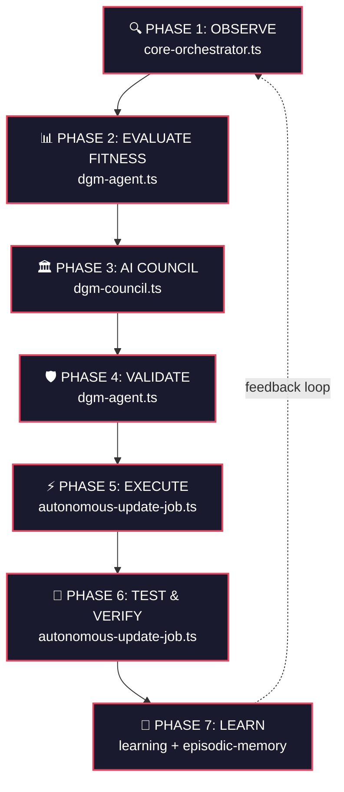
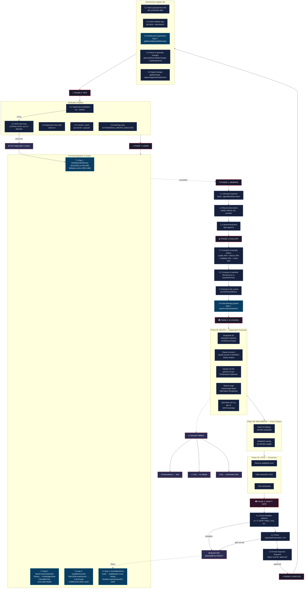

# DGM Pipeline — Fluxograma Completo

## Visão Macro (7 Fases)

## Fluxograma Detalhado com Sub-Níveis

## Tabela de Componentes

| Fase | Arquivo | Função Principal | Módulos de Learning |
|------|---------|-----------------|---------------------|
| 1. Observe | `core-orchestrator.ts` | `layer7_dgmMetaObservation` | — |
| 2. Evaluate | `dgm-agent.ts` | `evaluateFitness` | Gap 2: `learnFromEvolutionRun` |
| 3. Council | `dgm-council.ts` | `runCouncilSession` | — |
| 4. Validate | `dgm-agent.ts` | `validateProposal` | Gap 4: `storeAMemEntry` |
| 5. Execute | `autonomous-update-job.ts` | `executeAutonomousUpdate` | Gap 3: `getRecentEpisodicMemories` |
| 6. Test | `autonomous-update-job.ts` | tsc + vitest + SICA | — |
| 7. Learn | `episodic-memory.ts` / `learning.ts` | `storeEpisodicMemory` | Gap 1: Reflexion |
