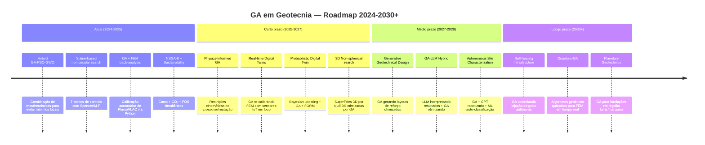

# Algoritmos Genéticos em Geotecnia — Revisão SOTA (2023–2025)

> Revisão sistemática de 50 artigos e fontes de estado da arte sobre aplicações de Algoritmos Genéticos (GA) e metaheurísticas em engenharia geotécnica, com mapeamento completo de aplicações e roadmap tecnológico.

---

## 1. Taxonomia dos Métodos de Análise de Estabilidade

Conforme destacado pelo usuário, é fundamental distinguir quatro categorias metodológicas:

| Categoria | Exemplos | Papel do GA |
|:---|:---|:---|
| **Métodos Clássicos (LEM)** | Bishop Simplificado, Morgenstern-Price, Fellenius, Spencer, Janbu | GA otimiza a busca pela superfície CRÍTICA; FOS calculado pelo LEM |
| **Diferenças Finitas (FDM)** | FLAC, FLAC3D | GA calibra parâmetros constitutivos do solo via análise inversa |
| **Elementos Finitos (FEM)** | Plaxis, ABAQUS, GeoStudio | GA acoplado ao FEM para RBDO, back-analysis e Digital Twins |
| **GA como método autônomo** | Busca de superfícies não-circulares por splines, otimização de projeto, previsão de liquefação | GA é o método computacional principal (não wrapper) |

> [!IMPORTANT]
> GA em geotecnia NÃO é apenas um otimizador aplicado sobre LEM. É um campo autônomo com aplicações que vão desde identificação de parâmetros até projeto generativo.

---

## 2. Aplicações — 10 Domínios Principais

### 2.1 Busca de Superfícies de Ruptura Não-Circulares
GA define superfícies por pontos de controle (splines) em vez de arcos circulares, permitindo formas realistas em solos heterogêneos.

| # | Referência | Ano | Contribuição |
|---|:---|:---:|:---|
| 1 | Zhao et al., *Multi-island GA for global search in high-variability soils* | 2023 | GA com multi-ilhas para evitar mínimos locais em solos com alta variabilidade |
| 2 | MGA-MPCX, *Modified GA with Multi-Parametric Convex Crossover* | 2024 | Crossover convexo multiparamétrico para superfícies críticas não-circulares |
| 3 | HGA, *Hybrid GA for circular + non-circular search* | 2024 | Bishop para circular, Morgenstern-Price melhorado para não-circular |
| 4 | Leapfrog + Spencer, *Arbitrary shape slip surface search* | 2024 | Novo algoritmo combinando Leapfrog com Spencer para formas arbitrárias |
| 5 | PSO-Spencer, *PSO-based non-circular analysis* | 2024 | PSO com método Spencer para taludes reforçados e não-reforçados |
| 6 | GA vs SHM, *Comparison with Simple Harmony Search* | 2024 | Benchmark comparativo: GA, SHM e método proposto para superfícies críticas |

---

### 2.2 Estimação de Parâmetros e Back-Analysis
GA calibra modelos constitutivos (Mohr-Coulomb, Hardening Soil, Cam-Clay) contra dados de campo.

| # | Referência | Ano | Contribuição |
|---|:---|:---:|:---|
| 7 | SAALG, *Automated back-analysis with GA* | 2024 | Calibração automática contínua de parâmetros em tempo real durante escavações |
| 8 | GADE, *Hybrid GA-Differential Evolution* | 2024 | Inversão multiparamétrica para modelos constitutivos em cavas de fundação |
| 9 | GA-Cam-Clay, *Constitutive model calibration* | 2023 | Otimização de parâmetros do Modified Cam-Clay com dados experimentais |
| 10 | GA-Elitism Study, *Impact of GA techniques on calibration* | 2024 | Análise de elitismo, crossover, mutação e tamanho de população na calibração |
| 11 | GA + Inclinometer, *Back-analysis from monitoring* | 2023 | Calibração inversa usando dados de inclinômetros em escavações urbanas |

---

### 2.3 Otimização de Fundações e Estruturas de Contenção
GA minimiza custos enquanto satisfaz restrições de segurança.

| # | Referência | Ano | Contribuição |
|---|:---|:---:|:---|
| 12 | GA-PSO-BPNN Hybrid, *Pile bearing capacity* | 2024 | Framework híbrido GA+PSO otimizando rede neural para capacidade de estacas |
| 13 | XGBoost-GA-ANFIS, *Reliability pile design* | 2024 | RBDO de fundações em estacas com XGBoost e ANFIS otimizados por GA |
| 14 | PSO-Retaining Wall, *Cost optimization* | 2024 | PSO para projeto ótimo de muros de gravidade e cantiléver |
| 15 | NSGA-II-Retaining, *Multi-objective wall optimization* | 2024 | Minimizar custo + maximizar FOS contra deslizamento e tombamento |
| 16 | GA-CO2-Retaining, *Sustainable wall design* | 2023 | Otimização de custo E emissões de CO₂ em muros sob cargas sísmicas |
| 17 | Multi-objective Pile Group, *Min settlement + min cost* | 2024 | Otimização multiobjetivo de comprimento e posição de estacas em grupo |

---

### 2.4 Tunelamento e Escavações
GA acoplado a FEM e ML para prever recalques e calibrar modelos em tempo real.

| # | Referência | Ano | Contribuição |
|---|:---|:---:|:---|
| 18 | GA-FEM Surface Subsidence, *Shield tunnel* | 2024 | GA otimizando ML para previsão de subsidência por tunelamento |
| 19 | GA-SVM Rock Classification, *TBM tunneling* | 2024 | SVM otimizado por GA para classificação de rocha em TBM |
| 20 | GA-DL TBM Optimization, *TBM advance rate* | 2024 | Deep learning + GA para otimizar hiperparâmetros de taxa de avanço |
| 21 | Back-analysis Tunnel Parameters, *Inverse analysis* | 2023 | GA para análise inversa de parâmetros de rocha em modelos FEM de túneis |

---

### 2.5 Barragens e Percolação
GA otimiza geometria de núcleos argilosos e calibra modelos de percolação.

| # | Referência | Ano | Contribuição |
|---|:---|:---:|:---|
| 22 | NSGA-II + Plaxis, *Dike stability optimization* | 2023 | NSGA-II com análise de redução de resistência em Plaxis via Python |
| 23 | SCE-SA-GA, *Clay core geometry optimization* | 2024 | Otimização geométrica de núcleo com restrições de gradiente hidráulico |
| 24 | ANN-GA-BBO, *Seepage flow estimation* | 2023 | ANN + GA + BBO para estimar vazão de percolação em barragens de terra |
| 25 | Transient FEM + GA, *Dam seepage prediction* | 2023 | Modelo térmico transitório FEM para previsão de percolação |
| 26 | GeoStudio SEEP/W, *Hysteresis + seepage stability* | 2024 | Análise de estabilidade sob níveis d'água flutuantes com histerese |

---

### 2.6 Análise de Confiabilidade (RBDO)
GA busca o "design point" em espaços probabilísticos de alta dimensão.

| # | Referência | Ano | Contribuição |
|---|:---|:---:|:---|
| 27 | GA-FORM-SORM, *Reliability-based slope analysis* | 2024 | GA para encontrar ponto de falha mais provável em análise FORM/SORM |
| 28 | GA-Censored Samples, *Reliability with censored data* | 2024 | Análise de confiabilidade com amostras censuradas usando GA |
| 29 | MCS vs FOSM vs FORM, *Comparative reliability* | 2023 | Comparação de MCS, FOSM e FORM para probabilidade de falha |
| 30 | Monte Carlo Root-Reinforced, *Probabilistic slope* | 2024 | Monte Carlo em taludes reforçados com raízes, incluindo análise de sensibilidade |
| 31 | GA-Response Surface, *Surrogate RBDO* | 2024 | GA + Response Surface Method para análise probabilística eficiente |

---

### 2.7 Otimização Multiobjetivo (NSGA-II)
Balancear custo, segurança e sustentabilidade simultaneamente.

| # | Referência | Ano | Contribuição |
|---|:---|:---:|:---|
| 32 | NSGA-II + pymoo + Plaxis, *Climate-responsive dike* | 2023 | Otimização climática de diques usando pymoo + Plaxis 2023.2 |
| 33 | Improved NSGA-II + Hill Climbing, *Engineering optimization* | 2024 | NSGA-II melhorado com hill climbing para engenharia civil |
| 34 | NSGA-II Geosynthetic Foundations, *Max capacity + min cost* | 2024 | Otimização de fundações reforçadas com geossintéticos |
| 35 | Hybrid NSGA-II Construction, *Time + cost + quality* | 2024 | Otimização de tempo, custo e qualidade em projetos de construção |

---

### 2.8 Liquefação e Previsão de Riscos
GA e GP para previsão de potencial de liquefação a partir de CPT/SPT.

| # | Referência | Ano | Contribuição |
|---|:---|:---:|:---|
| 36 | MGGP Liquefaction, *Multi-gene genetic programming* | 2024 | Previsão de liquefação com GP multi-gene usando dados CPT/SPT pós-evento |
| 37 | GA-SVM-PSO Liquefaction, *Hybrid prediction* | 2024 | Modelo híbrido GA+SVM+PSO com 80% de acurácia em liquefação |
| 38 | GP Formula Liquefaction, *Closed-form prediction* | 2023 | Fórmula analítica derivada por programação genética para liquefação |

---

### 2.9 Digital Twins e Monitoramento em Tempo Real
GA para calibração contínua de modelos FEM com dados de sensores IoT.

| # | Referência | Ano | Contribuição |
|---|:---|:---:|:---|
| 39 | GA-Digital Twin SHM, *Structural health monitoring* | 2025 | GA para model-updating em gêmeos digitais para SHM |
| 40 | Probabilistic Digital Twin, *Bayesian geotechnical design* | 2024 | Framework PDT com Bayesian updating para projeto geotécnico |
| 41 | Bayesian FEM-Dam, *Real-time deformation prediction* | 2024 | FEM + Bayesian + monitoramento em tempo real para barragens |
| 42 | GA Inverse Analysis, *Soil mechanics parameter ID* | 2024 | GA para identificação de parâmetros mecânicos em análise inversa |
| 43 | SAALG Real-time Back-analysis, *Continuous calibration* | 2024 | Calibração contínua automatizada em escavações urbanas |

---

### 2.10 Modelos Surrogados e Deep Learning Híbrido
GA otimiza arquiteturas de redes neurais para prever recalques e capacidade de carga.

| # | Referência | Ano | Contribuição |
|---|:---|:---:|:---|
| 44 | IWO-MLP + HHO-MLP, *Pile capacity prediction* | 2024 | Invasive Weed + Harris Hawks otimizando MLP para capacidade de estacas |
| 45 | ACO-ANN Foundation, *Strip footing under inclined load* | 2024 | ACO otimizando ANN para sapata corrida sob carga inclinada |
| 46 | GA-Settlement Shallow, *Settlement prediction* | 2024 | GA prevendo recalque de fundações superficiais vs. dados de campo |
| 47 | LSTM-Transformer, *Consolidation settlement* | 2024 | LSTM+Transformer para recalque de consolidação em argila profunda |
| 48 | Surrogate Cavity, *Foundation over cavities* | 2024 | Modelo surrogado para recalque de fundações sobre cavidades c/ incerteza |
| 49 | DL Surrogate Tunnel Crown, *Probabilistic settlement* | 2024 | DL surrogado para recalque de calota de túnel ferroviário em solo variável |
| 50 | ANN-FEM Shaft, *Shaft excavation in clay* | 2023 | ANN treinada com FEM para prever movimentos verticais em poços |

---

## 3. Roadmap Tecnológico

---

## 4. Mapa de Aplicações para o MOTHER SHMS

> [!TIP]
> Aplicações diretamente implementáveis no sistema MOTHER:

| Aplicação | Módulo SHMS | Complexidade | Prioridade |
|:---|:---|:---:|:---:|
| **Busca não-circular por splines** | Estabilidade → GA/PSO | Média | 🔴 Alta |
| **Back-analysis em tempo real** | Pipeline MQTT → FEM | Alta | 🔴 Alta |
| **NSGA-II custo+FOS+CO₂** | Estabilidade → Otimização | Média | 🟡 Média |
| **Previsão de liquefação (MGGP)** | Mapa de Risco → ML | Baixa | 🟡 Média |
| **Probabilistic Digital Twin** | LSTM + Bayesian + GA | Alta | 🟡 Média |
| **Classificação de solo por CPT** | Sondagens → ML | Baixa | 🟢 Baixa |
| **Modelo surrogado recalque** | Digital Twin 3D | Alta | 🟢 Baixa |

---

## 5. Fontes Consultadas

- **Bases acadêmicas**: arXiv, ResearchGate, Semantic Scholar, Google Scholar
- **Editoras**: MDPI (Sustainability, Applied Sciences, Geosciences), Elsevier, Springer, ASCE
- **Conferências**: ISSMGE 2023, Slope Stability 2024, GeoAmericas 2024
- **Software docs**: GeoStudio (SLOPE/W, SEEP/W), Plaxis 2023.2, Rocscience Slide2/RocSlope2
- **Fontes industriais**: SAALG.com, DigitalTwinGeotechnical.com
- **Período**: 2023–2025 (SOTA)
