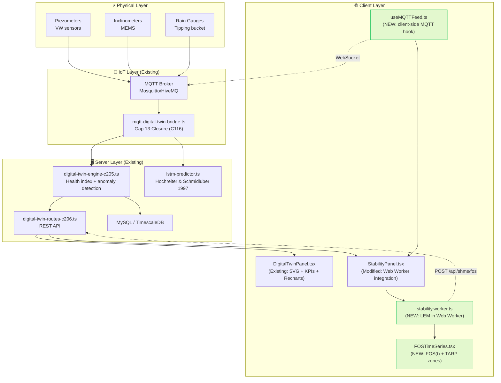
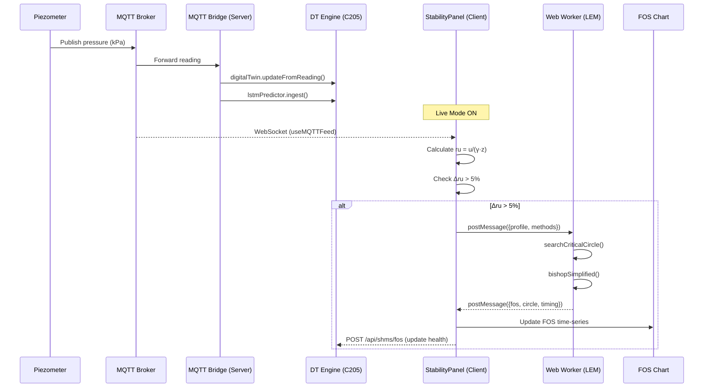
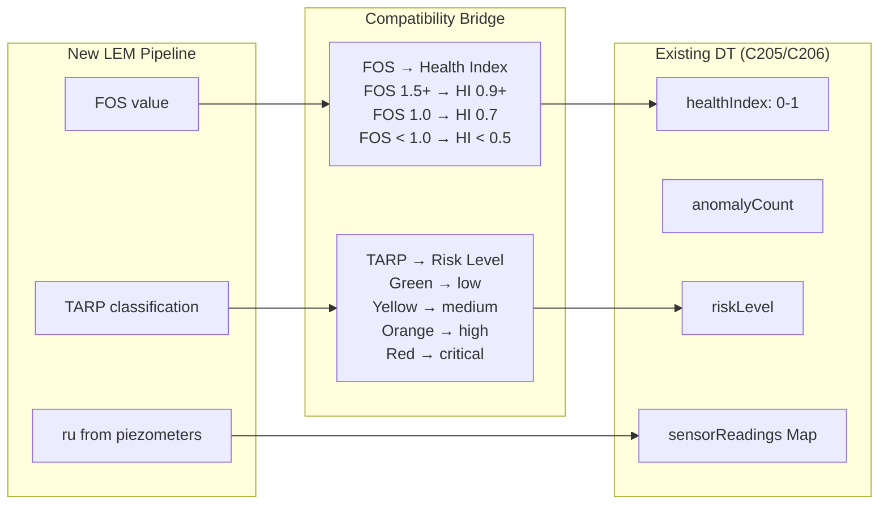
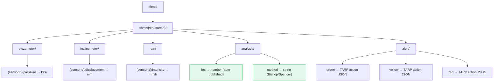
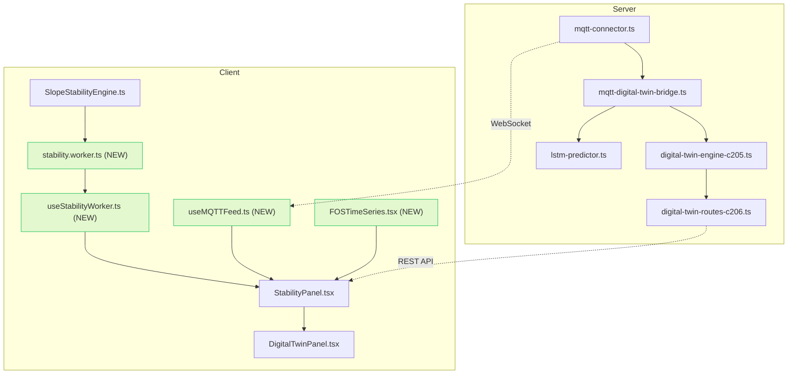

# LEM ↔ Digital Twin: Architecture & Compatibility Guide

> **Documento de Referência para Consulta e Manuais Futuros**
> Versão 1.0 | 2026-03-21

---

## 1. Existing Digital Twin Components

| Component | File | Role |
|:----------|:-----|:-----|
| DT Engine | `server/shms/digital-twin-engine-c205.ts` | Twin registry, anomaly detect (Z-score+IQR), health index |
| MQTT Bridge | `server/shms/mqtt-digital-twin-bridge.ts` | MQTT→DT→LSTM pipeline, <1s latency |
| DT Routes | `server/shms/digital-twin-routes-c206.ts` | REST API for twin state, alerts, sensor data |
| DT Dashboard | `server/shms/digital-twin-dashboard.ts` | Dashboard aggregation endpoint |
| DT Panel UI | `client/.../shms/DigitalTwinPanel.tsx` | SVG wireframe, KPIs, Recharts health/anomaly |
| 3D Viewer | `client/.../shms/DigitalTwin3DViewer.tsx` | 3D structure visualization |
| DT Display | `client/.../displays/SHMSDigitalTwinDisplay.tsx` | Read-only display component |

---

## 2. System Architecture Diagram



---

## 3. Data Flow Pipeline



---

## 4. Compatibility Layer Design



### 4.1 FOS → Health Index Mapping

| FOS Range | TARP | Health Index | Risk Level | DT Color |
|:----------|:-----|:-------------|:-----------|:---------|
| ≥ 1.5 | 🟢 Safe | 0.90 – 1.00 | `low` | Green |
| 1.3 – 1.5 | 🟡 Alert | 0.70 – 0.90 | `medium` | Yellow |
| 1.0 – 1.3 | 🟠 Warning | 0.50 – 0.70 | `high` | Orange |
| < 1.0 | 🔴 Critical | 0.00 – 0.50 | `critical` | Red |

### 4.2 Integration Points

| Existing DT API | LEM Integration | Direction |
|:----------------|:----------------|:---------|
| `ingestSensorReading(pore_pressure)` | Triggers ru recalculation | DT → LEM |
| `DigitalTwinState.healthIndex` | Updated with FOS-derived value | LEM → DT |
| `DigitalTwinState.riskLevel` | Updated with TARP classification | LEM → DT |
| `DigitalTwinPanel` radar "Estabilidade" | Populated with real Bishop FOS | LEM → DT |
| `MQTT bridge` simulation fallback | Feeds simulated pore_pressure to LEM | DT → LEM |

---

## 5. MQTT Topic Topology



---

## 6. Component Integration Pattern

### Where LEM Plugs Into the Existing DT Panel

The existing `DigitalTwinPanel.tsx` radar chart has **"Estabilidade"** as one of its 6 axes, currently using `70 + Math.random() * 25` (line 178):

```diff
- { axis: 'Estabilidade', value: 70 + Math.random() * 25 },
+ { axis: 'Estabilidade', value: fosToPct(currentFOS) },
```

Where `fosToPct` maps FOS to 0-100 scale:
```typescript
function fosToPct(fos: number | null): number {
  if (!fos) return 50;
  return Math.min(100, Math.max(0, (fos / 2.0) * 100));
}
```

---

## 7. Reference Manual: API Endpoints

### Existing DT REST API (digital-twin-routes-c206.ts)

| Endpoint | Method | Description |
|:---------|:-------|:-----------|
| `/api/shms/digital-twin/state/:structureId` | GET | Get twin state |
| `/api/shms/digital-twin/readings/:structureId` | GET | Get sensor readings |
| `/api/shms/digital-twin/alerts` | GET | Get active alerts |
| `/api/shms/digital-twin/alerts/:alertId/ack` | POST | Acknowledge alert |
| `/api/shms/digital-twin/predict/:structureId` | POST | Run prediction |

### New LEM API Endpoints (to add)

| Endpoint | Method | Description |
|:---------|:-------|:-----------|
| `/api/shms/stability/fos/:structureId` | GET | Get latest FOS |
| `/api/shms/stability/history/:structureId` | GET | Get FOS history (24h) |
| `/api/shms/stability/tarp/:structureId` | GET | Get TARP classification |

---

## 8. File Dependency Map



---

## 9. Glossary

| Term | Definition |
|:-----|:-----------|
| **FOS** | Factor of Safety — ratio of resisting to driving forces |
| **ru** | Pore pressure ratio — u/(γ·z), ranges 0–1 |
| **TARP** | Trigger Action Response Plan — regulatory framework |
| **LEM** | Limit Equilibrium Method — Bishop, Spencer, M-P |
| **DT** | Digital Twin — virtual replica of physical structure |
| **MQTT** | Message Queuing Telemetry Transport (ISO/IEC 20922) |
| **SSR** | Shear Strength Reduction — FEM-based FOS |
| **HI** | Health Index — 0.0 (critical) to 1.0 (healthy) |
