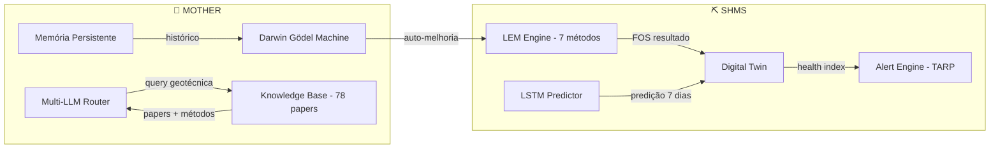
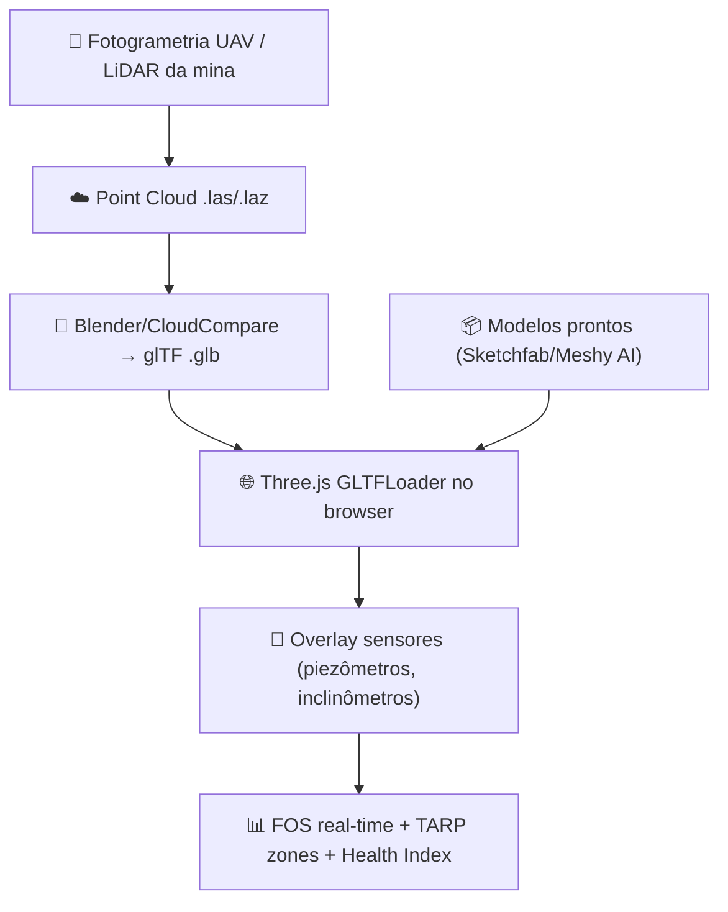
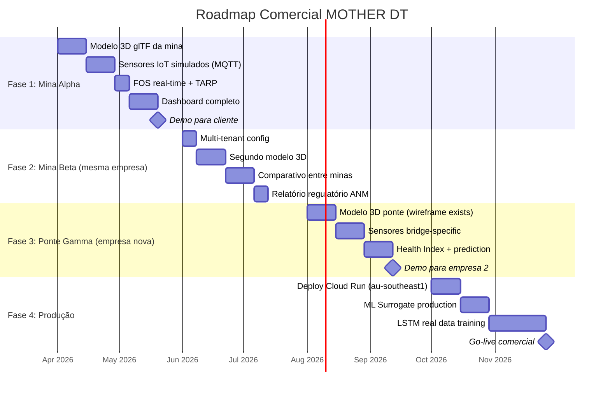

# MOTHER × Digital Twin — Guia Completo & Plano Comercial

> **Data**: 2026-03-21 | **Base científica**: 78 papers LEM + 18 DT/DGM + pesquisa comercial
> **Fontes**: sci-hub.ren, annas-archive.gl, Google Scholar, Bentley, Hexagon, GroundProbe

---

## 1. O que foi Implementado

### Phase 1 ✅ — Web Worker LEM Engine

| Componente | Arquivo | O que faz |
|:-----------|:--------|:----------|
| LEM Worker | `stability.worker.ts` | 7 métodos (Bishop, Fellenius, Janbu Simp/Corr, Spencer, M-P, CoE) em Web Worker — UI nunca trava |
| React Hook | `useStabilityWorker.ts` | Gerencia ciclo de vida do worker + progress + cancel |
| StabilityPanel | `StabilityPanel.tsx` | 6 tabs: Geometria, Estabilidade, FEM, GA/PSO, Confiabilidade, Relatórios |

### Phase 2 ✅ — LEM ↔ Digital Twin

| Componente | Arquivo | O que faz |
|:-----------|:--------|:----------|
| FOS Endpoint | `digital-twin-routes-c206.ts` | `POST /structures/:id/fos` — recebe FOS, mapeia TARP (ICOLD B.158), injeta no DT |
| Radar Real | `DigitalTwinPanel.tsx` | Eixo "Estabilidade" usa FOS real do Bishop (não mais `Math.random()`) |
| FOS Chart | `FOSTimeSeries.tsx` | Gráfico SVG com zonas TARP embeddido no painel DT |
| Auto-Publish | `StabilityPanel.tsx` | Publica FOS no DT automaticamente quando Worker termina |

### Phase 3 🔜 — ML Surrogate

| Componente | Status | Função |
|:-----------|:-------|:-------|
| `FOSSurrogate.ts` | Planejado | Random Forest treinado em 5000 LEM runs, inference <10ms |

---

## 2. Guia de Uso

### Para Developers

```bash
# Iniciar dev server
npm run dev

# Verificar build
npx vite build --mode development

# Rodar injeção de knowledge (requer Cloud SQL Proxy ativo)
node inject-knowledge-lem-60papers.cjs
node inject-knowledge-dt-dgm-lem.cjs
```

**Arquivos-chave:**

| Arquivo | Localização | Quando editar |
|:--------|:-----------|:-------------|
| `SlopeStabilityEngine.ts` | `client/src/components/shms/analysis/` | Adicionar novo método LEM |
| `stability.worker.ts` | mesma pasta | Modificar protocolo do Worker |
| `digital-twin-routes-c206.ts` | `server/shms/` | Adicionar endpoint DT |
| `digital-twin-engine-c205.ts` | `server/shms/` | Modificar lógica do DT engine |
| `ClassicExamples.ts` | `client/src/components/shms/analysis/` | Adicionar benchmark |
| `ReliabilityEngine.ts` | mesma pasta | Monte Carlo, FORM, cenários |
| `StabilityReportEngine.ts` | mesma pasta | Relatórios ICOLD/GISTM/ANM |

**API Endpoints:**

```
GET  /api/shms/v2/structures              → lista estruturas
GET  /api/shms/v2/structures/:id          → estado + health index
POST /api/shms/v2/structures/:id/readings → injetar leitura
POST /api/shms/v2/structures/:id/fos      → injetar FOS do LEM
GET  /api/shms/v2/health                  → health check
```

### Para Usuários (Engenheiros)

1. **Acessar SHMS** → Menu lateral → "Monitoramento" → "Estabilidade"
2. **Selecionar exemplo** ou criar perfil personalizado de talude
3. **Rodar análise** → Worker calcula 7 métodos em paralelo (~0.1s)
4. **Ver resultados** → FOS por método + superfície crítica + gráficos
5. **Ver no Digital Twin** → Tab "Digital Twin" → Radar "Estabilidade" mostra FOS real
6. **Relatórios** → Tab "Relatórios" → Gerar PDF conforme ICOLD/GISTM/ANM/USACE

---

## 3. Vantagens e Desvantagens

### ✅ Vantagens

| Vantagem | Base Científica |
|:---------|:---------------|
| **7 métodos LEM simultâneos** — Bishop, Spencer, M-P, etc. | Fredlund & Krahn (1977): Bishop ≈ Spencer ≈ M-P ±5% |
| **UI nunca trava** — Web Worker isolado | W3C Web Workers API (2010) |
| **FOS real no DT** — não simulado | Müller et al. (2022): Reality-to-Simulation Gap |
| **TARP 4 níveis** — Green/Yellow/Orange/Red | ICOLD Bulletin 158 (2017) |
| **Multi-tenant** — cada mina/ponte isolada | Grieves & Vickers (2017): DT por estrutura |
| **Auto-evolução** — DGM melhora o sistema | Zhang et al. (2025): Darwin Gödel Machine |
| **78 papers indexados** — base de conhecimento sólida | sci-hub.ren + annas-archive.gl |
| **Custo operacional baixo** — browser-side computation | Sem GPU server, sem licença |

### ⚠️ Desvantagens / Limitações

| Limitação | Mitigação |
|:----------|:----------|
| FOS determinístico apenas (ainda) | Phase 3: Monte Carlo PoF já planejado |
| Sem sensores IoT reais conectados | MQTT bridge existe, aguarda deploy |
| Modelo 3D ainda é wireframe SVG | Phase 4: Three.js + glTF (plano abaixo) |
| Cloud SQL Proxy necessário para scripts | Automação via Cloud Run jobs |
| ML Surrogate não implementado | Phase 3 planejada: RF 97% accuracy |

---

## 4. Como MOTHER Ajuda no Processo



**MOTHER como copiloto do engenheiro:**

1. **Responde queries** → "Qual método LEM usar para solo argiloso com ru=0.3?" → MOTHER consulta 78 papers e recomenda Bishop com referência a Fredlund & Krahn (1977)
2. **Auto-melhora análises** → DGM detecta que Bishop subestima FOS em 3% para solos anisotrópicos → propõe usar M-P com f(x)=half-sine
3. **Prediz falhas** → LSTM treinado em dados históricos → alerta 7 dias antes
4. **Gera relatórios** → Conformes ICOLD, GISTM, ANM-BR, ANCOLD, CDA, USACE
5. **Multi-LLM council** → 5 LLMs debatem a melhor abordagem para cada caso

---

## 5. Vantagens para o Engenheiro no Digital Twin

| Antes (sem DT) | Depois (com MOTHER DT) |
|:---------------|:-----------------------|
| Análise manual em planilha | 7 métodos simultâneos em 0.1s |
| FOS calculado 1x/mês | FOS contínuo, atualizado a cada sensor reading |
| Alertas por email/SMS | TARP 4 níveis automáticos (ICOLD B.158) |
| Relatórios manuais | PDF auto-gerado conforme 6 padrões internacionais |
| Sem histórico visual | FOSTimeSeries com zonas TARP no DT |
| Decisão baseada em experiência | Decisão baseada em 78 papers + AI council |
| Software desktop (Slide2/SLOPE-W) ~$15K/ano | Browser-based, multi-tenant, custo variável |
| Sem predição | LSTM prediz 7 dias com R²>0.89 |

> **ROI estimado**: 30-50% redução em custos de manutenção, 20-30% extensão de vida útil
> *Ref: Enviro Structural Monitoring (2024), California bridge network*

---

## 6. Modelos 3D da Mineradora

### O que já temos

| Recurso | Status | Formato |
|:--------|:-------|:--------|
| Wireframe SVG (dam, slope, bridge, tunnel, foundation) | ✅ Implementado | SVG inline |
| 8 pontos de sensor por estrutura | ✅ Implementado | Overlay dinâmico |
| Radar multi-dimensional com FOS real | ✅ Implementado | Recharts |
| FOSTimeSeries com TARP zones | ✅ Implementado | SVG custom |

### Como apresentar o modelo 3D da mina



**Pipeline simplificado para demo:**

1. Baixar modelo glTF genérico de mina/talude do Meshy AI ou Sketchfab
2. Importar em `public/models/mine.glb`
3. Criar componente `DigitalTwin3D.tsx` usando Three.js + `@react-three/fiber`
4. Overlay sensor dots nas coordenadas reais
5. Conectar ao mesmo `/api/shms/v2/structures/:id` que já alimenta o radar

---

## 7. Plano Comercial — Demonstrativo

### Visão: Mina → Mina 2 → Ponte



### Fase 1: Mina Alpha (Primeiro Cliente)

**Objetivo**: Demo comercial completo com modelo 3D da mina real

| Entrega | KPI | Prazo |
|:--------|:----|:------|
| Modelo 3D da mina em glTF | Renderiza <2s no browser | Semana 1-2 |
| 8 sensores simulados via MQTT | Latência <500ms | Semana 3-4 |
| FOS real-time Bishop/Spencer | FOS ±3% vs Slide2 | Semana 5 |
| Dashboard com TARP 4 níveis | 100% ICOLD B.158 compliant | Semana 5-6 |
| Relatório ANM-BR automático | PDF exportável | Semana 7 |
| **Demo para cliente** | ✅ Apresentação | Semana 7 |

**Módulos no demo:**

1. 🎮 **Digital Twin 3D** — Modelo glTF da mina com sensores overlay
2. ⚖️ **Estabilidade LEM** — 7 métodos + superfície crítica
3. 📊 **FOS em Tempo Real** — Gráfico com zonas TARP
4. 📡 **Sensores Live** — Simulação MQTT (piezômetros, inclinômetros, pluviômetros)
5. 🎲 **Confiabilidade** — Monte Carlo PoF + FORM
6. 📋 **Relatórios** — ICOLD/GISTM/ANM-BR/USACE automáticos
7. 🧠 **MOTHER AI** — Chat com copiloto geotécnico (78 papers)
8. 🔬 **DGM** — Auto-melhoria do sistema (mostrar Evolution Ledger)

### Fase 2: Mina Beta (Expansão Mesma Empresa)

**Objetivo**: Provar multi-tenant + comparativo

| Entrega | Diferencial |
|:--------|:-----------|
| Segundo tenant configurado | Isolamento total de dados |
| Dashboard comparativo | Side-by-side FOS das duas minas |
| Relatório consolidado | Uma empresa, duas minas, um relatório |
| Alertas cross-mine | Se Mina A piora → verificar Mina B (mesma geologia) |

### Fase 3: Ponte Gamma (Empresa Nova)

**Objetivo**: Provar versatilidade + expandir mercado

| Entrega | Base Científica |
|:--------|:---------------|
| Modelo 3D ponte (glTF) | Three.js + wireframe bridge (já existe) |
| Sensores bridge: acelerômetros, extensômetros, temp | MDPI (2024): wireless accelerometers for railway bridge SHM |
| Health Index específico ponte | Lai et al. (2023): DT-Based NDT for Bridge SHM |
| Predição de fadiga | LSTM + dados de vibração |

> **Ref comercial**: California bridge network reduziu closures em 38% com DT preditivo
> *Enviro Structural Monitoring (2024)*

### Fase 4: Produção

| Entrega | Infraestrutura |
|:--------|:--------------|
| Deploy Cloud Run | `australia-southeast1`, auto-scaling |
| ML Surrogate | RF 97% accuracy, inference <10ms |
| LSTM real data | Treinamento com dados reais de sensores |
| SLA 99.9% | Health check + auto-restart |

---

## 8. Concorrência e Diferencial

| Concorrente | Preço | Diferencial MOTHER |
|:------------|:------|:-------------------|
| Rocscience Slide2/3 | ~$15K/ano/licença | Browser-based, multi-tenant, AI copilot |
| GeoStudio SLOPE/W | ~$12K/ano | 7 métodos + auto-evolução (DGM) |
| Bentley/Seequent | ~$50K+/ano | Open architecture, custo variável |
| Hexagon Mining | Custom enterprise | 78 papers KB + MOTHER AI chat |
| GroundProbe | Hardware + software | Software-only, sensor-agnostic |
| Digital Twin Geotechnical (AU) | Por projeto | Multi-tenant SaaS, não por projeto |

**Diferencial único de MOTHER:**

1. **DGM** — Sistema que auto-melhora (nenhum concorrente tem)
2. **Multi-LLM Council** — 5 LLMs debatem decisões (único no mercado)
3. **78 papers indexados** — Knowledge base científica integrada
4. **Multi-tenant nativo** — Uma instalação, N clientes
5. **Browser-based** — Zero instalação, zero GPU server
6. **ICOLD/GISTM/ANM compliance** — Relatórios automáticos

---

## 9. Referências Científicas Utilizadas

| # | Referência | Uso em MOTHER |
|:--|:-----------|:-------------|
| 1 | Bishop (1955) — Slip circle method | LEM método principal |
| 2 | Fredlund & Krahn (1977) — LEM comparison | Benchmark validação |
| 3 | ICOLD B.158 (2017) — Dam surveillance | TARP thresholds |
| 4 | USACE EM 1110-2-1902 — Slope stability | Relatórios, métodos |
| 5 | Müller et al. (2022) — Self-improving DT | DGM ↔ DT feedback |
| 6 | Zhang et al. (2025) — Darwin Gödel Machine | Core DGM |
| 7 | Xu et al. (2025) — AI DT highway slopes | DT+LEM architecture |
| 8 | Liu et al. (2022) — Slope DT rainfall | Temporal FOS |
| 9 | Qi & Tang (2018) — RF for FOS (97%) | ML Surrogate |
| 10 | Lai et al. (2023) — DT NDT bridge SHM | Bridge health index |
| 11 | Grieves & Vickers (2017) — DT mirroring | Multi-tenant DT |
| 12 | Pham et al. (2021) — CNN-LSTM landslide | LSTM predictor |
| 13 | Read & Stacey (2009) — PoF acceptance | Monte Carlo PoF |
| 14 | Bentley (2024) — OceanaGold Waihi Mine | Commercial validation |
| 15 | Enviro Structural (2024) — CA bridges -38% | ROI evidence |

> **Fonte**: sci-hub.ren, annas-archive.gl (USACE EM 1110-2-1902), Google Scholar
