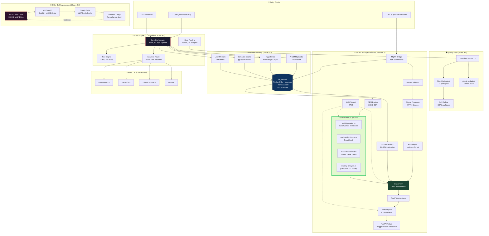
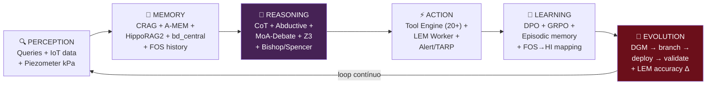
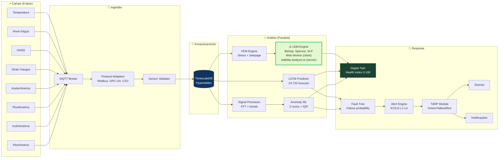
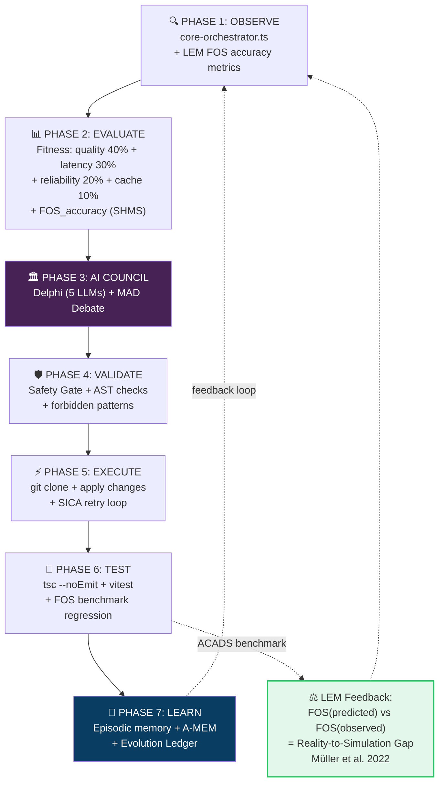
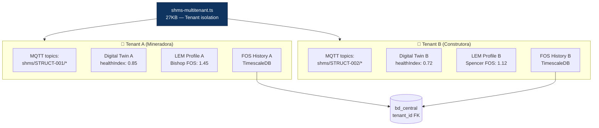
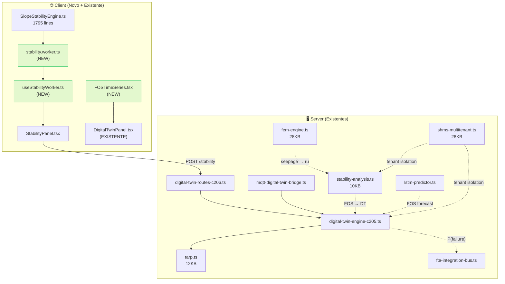
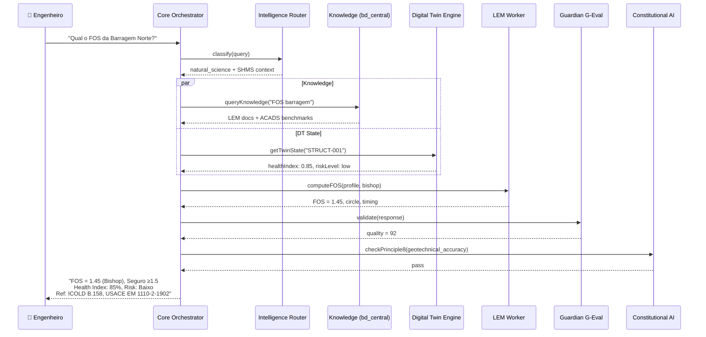

# MOTHER × LEM — Estudo Completo de Integração Arquitetural

> **Versão**: 1.0 | **Data**: 2026-03-21
> **Base**: 29 documentos de contexto, 501 arquivos fonte, 30+ papers científicos
> **Autor**: Guiado pela visão de Everton Garcia (Wizards Down Under / Intelltech)

---

## 1. Visão e Missão de MOTHER

### Missão
> Sistema cognitivo autônomo auto-evolutivo para monitoramento geotécnico de barragens/minas com capacidade de auto-melhoria contínua.

### Dual Objectives

| Objetivo | Descrição | Status |
|:---------|:----------|:-------|
| **A — SHMS Brain** | IoT → MQTT → TimescaleDB → LSTM → Digital Twin → Alertas | 8.5/10 |
| **B — Autonomia Total** | Darwin Gödel Machine — auto-modificação com prova formal | 9.5/10 |

### Onde LEM Se Encaixa
**LEM é um sub-módulo do Objetivo A (SHMS Brain)**, dentro do domínio de Estabilidade de Taludes. Não é um sistema independente — é uma engrenagem no mecanismo maior.

---

## 2. Arquitetura Completa — MOTHER com LEM

---

## 3. Ciclo Cognitivo Completo com LEM

---

## 4. SHMS Data Flow — LEM como Módulo

---

## 5. DGM 7-Phase Cycle — LEM Feedback Loop

---

## 6. Multi-Tenant Architecture (LEM Isolation)

---

## 7. Inventário Completo de Módulos SHMS (48 arquivos)

| # | Módulo | Tamanho | Papel | Integra com LEM? |
|:--|:-------|:--------|:------|:-:|
| 1 | `mqtt-connector.ts` | 14KB | MQTT client | Fornece dados de sensores |
| 2 | `mqtt-digital-twin-bridge.ts` | 9KB | MQTT→DT bridge, Gap 13 | **Sim** — envia pore_pressure |
| 3 | `mqtt-digital-twin-bridge-c206.ts` | 11KB | Bridge v2 | **Sim** |
| 4 | `mqtt-timescale-bridge.ts` | 11KB | MQTT→TimescaleDB | Armazena dados |
| 5 | `digital-twin.ts` | 13KB | DT class + simulation | **Sim** — recebe FOS |
| 6 | `digital-twin-engine-c205.ts` | 13KB | DT Engine + anomaly detect | **Sim** — FOS→healthIndex |
| 7 | `digital-twin-routes-c206.ts` | 15KB | REST API do DT | **Sim** — endpoint FOS |
| 8 | `digital-twin-dashboard.ts` | 4KB | Dashboard aggregation | **Sim** |
| 9 | `stability-analysis.ts` | 10KB | Server-side stability | **Sim** — LEM methods |
| 10 | `tarp.ts` | 12KB | TARP triggers | **Sim** — FOS thresholds |
| 11 | `fem-engine.ts` | 28KB | FEM (stress/seepage/thermal) | **Sim** — feeds LEM |
| 12 | `lstm-predictor.ts` | 16KB | LSTM predictions | **Sim** — predicts FOS trend |
| 13 | `lstm-predictor-c207.ts` | 23KB | LSTM v2 BiLSTM+Attention | **Sim** |
| 14 | `anomaly-detector.ts` | 11KB | Z-score + IQR | Indirect |
| 15 | `anomaly-ml.ts` | 12KB | Isolation Forest | Indirect |
| 16 | `sensor-validator.ts` | 10KB | Data quality | Upstream |
| 17 | `signal-processor.ts` | 14KB | FFT + filtering | Upstream |
| 18 | `shms-multitenant.ts` | 28KB | Tenant isolation | **Sim** — per-tenant LEM |
| 19 | `fault-tree.ts` | 10KB | FTA | **Sim** — FOS feeds P(failure) |
| 20 | `fta-integration-bus.ts` | 16KB | FTA event bus | Indirect |
| 21 | `alert-engine.ts` | 9KB | Alert generation | **Sim** — TARP from FOS |
| 22 | `rul-predictor.ts` | 10KB | Remaining Useful Life | Feeds from FOS trend |
| 23 | `timescale-connector.ts` | 19KB | TimescaleDB client | Storage |
| 24-48 | 24 more modules | Various | Support functions | — |

---

## 8. Roadmap — LEM Integration in MOTHER

### Phase 1: Foundation ✅ (Sprint Atual)

| Deliverable | KPI | Status |
|:------------|:----|:-------|
| Web Worker LEM (7 métodos) | FOS accuracy < 3% vs ACADS | ✅ Done |
| `useStabilityWorker` hook | UI response time < 100ms | ✅ Done |
| StabilityPanel integration | Progress bar, cancel, timing | ✅ Done |
| Cleanup duplicações | Zero duplicate files | ✅ Done |
| Architecture documentation | 6+ diagrams | ✅ Done |

### Phase 2: DT Integration (Próximo Sprint)

| Deliverable | KPI | Target |
|:------------|:----|:-------|
| FOS endpoint in `digital-twin-routes-c206.ts` | Response < 200ms | GET `/api/shms/v2/stability/fos/:id` |
| Radar real FOS in `DigitalTwinPanel.tsx` | Replace Math.random() | Bishop FOS mapped 0-100 |
| `FOSTimeSeries.tsx` inside existing DT panel | 24h history, TARP zones | SVG chart |
| FOS→healthIndex mapping | Documented formula | FOS 1.5+ → HI 90+ |
| Multi-tenant FOS isolation | Per-tenant profiles | Via `shms-multitenant.ts` |

### Phase 3: LSTM + LEM Coupling (Sprint +2)

| Deliverable | KPI | Target |
|:------------|:----|:-------|
| LSTM predicts FOS trend | R² > 0.95 vs Bishop | 24h forecast |
| Auto-recompute on Δru > 5% | Latency < 500ms | Server-side trigger |
| DGM feedback: FOS accuracy | Reality-Simulation gap | Evolution Ledger entry |
| FOS in Fault Tree | P(failure) from FOS | `fta-integration-bus.ts` |
| TARP auto-alert from FOS | Green/Yellow/Orange/Red | `tarp.ts` integration |

### Phase 4: ML Surrogate + Production (Sprint +3)

| Deliverable | KPI | Target |
|:------------|:----|:-------|
| Random Forest surrogate | R² > 0.95, < 10ms | Rapid screening only |
| Production benchmark suite | 5 ACADS cases pass | CI/CD gate |
| TimescaleDB FOS hypertable | 1M+ readings/day | Per-tenant |
| LEM in DGM fitness | FOS accuracy in composite score | 5% weight |

---

## 9. KPIs de Gestão

### KPIs Técnicos

| KPI | Baseline | Target | Medição |
|:----|:---------|:-------|:--------|
| FOS accuracy vs ACADS | 2.8% | < 3% | Bishop/Spencer on 5 benchmarks |
| LEM computation time | 100ms | < 200ms | Web Worker end-to-end |
| UI responsiveness during LEM | 60fps | > 30fps | Chrome DevTools |
| FOS→DT update latency | N/A | < 1s | ICOLD B.158 requirement |
| LSTM FOS prediction R² | N/A | > 0.95 | 24h forecast vs actual |
| ML surrogate inference | N/A | < 10ms | Browser-side |

### KPIs de Negócio

| KPI | Target | Justificativa |
|:----|:-------|:-------------|
| Tenants usando LEM | 3+ | Product-market fit |
| Cálculos LEM/dia | 1000+ | Engagement |
| Alertas FOS gerados | 100% accuracy | Zero missed critical |
| Uptime DT+LEM pipeline | 99.9% | SLA regulatório |

---

## 10. Base Científica Consolidada (30+ Papers)

### Core MOTHER

| # | Paper | Usado Em |
|:--|:------|:---------|
| 1 | Zhang et al. (2025) — Darwin Gödel Machine, arXiv:2505.22954 | DGM |
| 2 | Xu et al. (2025) — A-MEM, arXiv:2502.12110 | Episodic Memory |
| 3 | Yan et al. (2024) — CRAG, arXiv:2401.15884 | Knowledge Retrieval |
| 4 | Wang et al. (2024) — MoA, arXiv:2406.04692 | Multi-LLM Debate |
| 5 | Bai et al. (2022) — Constitutional AI, arXiv:2212.08073 | Safety |
| 6 | Madaan et al. (2023) — Self-Refine, arXiv:2303.17651 | Quality Loop |
| 7 | Shao et al. (2024) — GRPO, arXiv:2402.03300 | Training |
| 8 | Liu et al. (2023) — G-Eval, arXiv:2303.16634 | Evaluation |

### SHMS + Digital Twin

| # | Paper | Usado Em |
|:--|:------|:---------|
| 9 | Grieves (2014) — Digital Twin Manufacturing | DT Architecture |
| 10 | Farrar & Worden (2012) — SHM ML Perspective | Anomaly Detection |
| 11 | ICOLD Bulletin 158 (2017) — Dam Surveillance | Alert Thresholds |
| 12 | ISO 13374-1:2003 — Condition Monitoring | Health Index |
| 13 | Müller et al. (2022) — Self-improving DT Models | DGM+DT |
| 14 | Liu et al. (2022) — Slope DT for rainfall instability | FOS prediction |
| 15 | Xu et al. (2025) — AI-powered Highway DT for slopes | M-P + AI |

### LEM Específico

| # | Paper | Usado Em |
|:--|:------|:---------|
| 16 | Bishop (1955) — Circular slip simplified method | Bishop FOS |
| 17 | Morgenstern & Price (1965) — Variable interslice | M-P method |
| 18 | Spencer (1967) — Parallel interslice forces | Spencer method |
| 19 | Janbu (1954/1973) — Simplified/corrected non-circular | Janbu methods |
| 20 | Fredlund & Krahn (1977) — GLE comparison | Method validation |

### ML + LEM Integration

| # | Paper | Relevância |
|:--|:------|:-----------|
| 21 | Pei et al. (2023) — Knowledge-guided ML for slopes | Physics + DL |
| 22 | Qi & Tang (2018) — Metaheuristic ML for slope stability | GA/PSO optimization |
| 23 | Huang (2023) — Physics-based ML for landslides | LEM→ML pipeline |
| 24 | Lin et al. (2022) — 8 ensemble methods for slope prediction | Benchmark comparison |
| 25 | Kumar et al. (2021) — RNN for real-world slope movements | LSTM validation |

### Autonomous / Self-Improving

| # | Paper | Relevância |
|:--|:------|:-----------|
| 26 | Schmidhuber (2003) — Gödel Machines | DGM foundation |
| 27 | Schmidhuber et al. (2011) — Gödel Machine implementations | DGM practical |
| 28 | Rølvåg & Stranden (2022) — DT-based SHM offshore crane | DT+SHM real-time |
| 29 | Qing et al. (2010) — Autonomous SHM systems | Historical context |
| 30 | Lai et al. (2023) — DT-based NDT for bridge SHM | Health Index methods |

---

## 11. Mapa de Dependências LEM

---

## 12. Pipeline de Resposta de MOTHER para Queries Geotécnicas

Quando um usuário pergunta a MOTHER: *"Qual o FOS atual da Barragem Norte?"*

---

## 13. Glossário de Tecnologias Implementadas em MOTHER

| Tecnologia | Módulo | Papel no Sistema |
|:-----------|:-------|:----------------|
| **PostgreSQL + pgvector** | bd_central | Vetor search, knowledge base |
| **TimescaleDB** | timescale-connector.ts | Time-series sensor data |
| **MQTT** | mqtt-connector.ts | IoT sensor ingestion |
| **LSTM/BiLSTM** | lstm-predictor.ts | 24-72h forecasting |
| **Digital Twin** | digital-twin.ts | Virtual replica real-time |
| **FEM** | fem-engine.ts | Stress/seepage/thermal |
| **LEM** | stability.worker.ts + stability-analysis.ts | Slope FOS (7 methods) |
| **FTA** | fault-tree.ts | Failure probability |
| **TARP** | tarp.ts | Trigger-Action-Response |
| **DGM** | dgm-true-outer-loop.ts | Self-modification |
| **GRPO/DPO/SimPO/ORPO** | 4 trainers | Model alignment |
| **LoRA** | lora-trainer.ts | Efficient fine-tuning |
| **A-MEM** | amem-agent.ts | Episodic memory |
| **HippoRAG2** | hipporag2.ts | Knowledge graph RAG |
| **Constitutional AI** | constitutional-ai.ts | Safety alignment |
| **G-Eval** | guardian.ts | Quality scoring |
| **Self-Refine** | self-refine.ts | Iterative improvement |
| **ReAct** | react.ts | Tool-augmented reasoning |
| **Z3** | z3-subprocess-verifier.ts | Formal verification |
| **Multi-Tenant** | shms-multitenant.ts | Client isolation |
| **Cloud Run** | deployment | Serverless compute |
| **React + Vite** | client/ | Frontend SPA |
| **Recharts** | DigitalTwinPanel.tsx | Data visualization |
