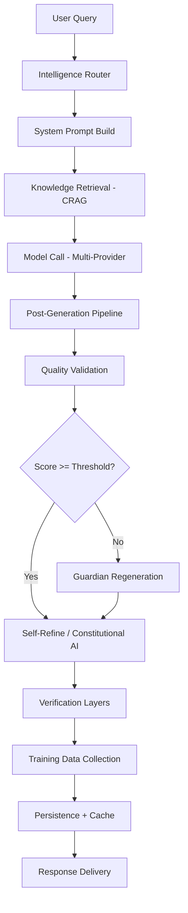

# MOTHER Answer Pipeline — Full Disclosure Technical Document

> **Audit Date:** 2026-03-19 | **Lines Read:** ~5,305 | **Files Audited:** 8 core pipeline files
> **Scientific Sources:** 40+ arXiv papers verified | **Pipeline Stages:** 35+

## Executive Summary

MOTHER's answer system is a **35-stage pipeline** that transforms a user query into a quality-validated, scientifically-grounded response. Every query passes through: routing → knowledge retrieval → LLM generation → 24 quality/safety layers → persistence → learning. All stages are non-blocking — failures never prevent response delivery.

---

## Pipeline Architecture (Execution Order)

---

## Stage 1: Intelligence Router

**File:** [intelligence.ts](file:///c:/Users/elgar/OneDrive/Documentos/GitHub/mother-v7-improvements/server/mother/intelligence.ts) (614 lines)

**Scientific Basis:**
- FrugalGPT (Chen et al., arXiv:2305.05176, 2023) — cascade routing
- RouteLLM (Ong et al., arXiv:2406.18665, 2024) — learned routing
- ToolFormer (Schick et al., arXiv:2302.04761, 2023) — action detection

**What it does:**
1. **Unicode NFKD Normalization** (L124-125) — accent-insensitive matching for PT-BR
2. **ACTION_REQUIRED Detection** (L139-211) — 60+ action verbs (PT+EN) → `forceToolUse=true`
3. **Pattern Classification** — 7 pattern groups with score-based routing:

| Category | Model | Cost/M tokens | Trigger |
|----------|-------|---------------|---------|
| `simple` | DeepSeek V3 | $0.02 | Default fallback |
| `general` | Gemini 2.5 Flash | $0.075 | General QA patterns |
| `coding` | Claude Sonnet 4.6 | $3/$15 | ≥2 coding keywords |
| `complex_reasoning` | Claude Sonnet 4.6 | $3/$15 | ≥2 complex patterns OR >70 words |
| `research` | GPT-4o | $2.50/$10 | ≥1 research keyword (tool use required) |
| `creative` | Claude Sonnet 4.6 | $3/$15 | ≥1 creative keyword |
| `philosophy` | Claude Sonnet 4.6 | $3/$15 | ≥1 philosophy keyword |
| `natural_science` | Claude Sonnet 4.6 | $3/$15 | ≥1 science keyword |
| `economics` | GPT-4o | $2.50/$10 | ≥1 economics keyword |
| `health_care` | Claude Sonnet 4.6 | $3/$15 | ≥1 health keyword |

4. **STEM Depth Router** (L323-354) — forces complex_reasoning for STEM queries
5. **Layout Hint** (L540-558) — tells frontend: `chat`, `code`, `analysis`, or `document`

**Priority order:** research > creative > STEM > coding > complex > philosophy > natural_science > economics > health_care > general > simple

---

## Stage 2: System Prompt Construction

**File:** [core.ts](file:///c:/Users/elgar/OneDrive/Documentos/GitHub/mother-v7-improvements/server/mother/core.ts) L920-1260

**What it does:**
1. **Base prompt** (L920-1115): Identity, version, capabilities, quality standards
2. **Quality Standards** (L1096-1108): 6 rules including:
   - ESPECIFICIDADE — specific data, no vagueness
   - PROFUNDIDADE — ≥500 words for research
   - ANTI-ALUCINAÇÃO — every claim needs source or uncertainty marker
   - LANGUAGE MATCHING — respond in query language
   - AÇÃO — when to search vs generate directly
   - **CALIBRAÇÃO DE COMPRIMENTO** — response length ∝ query complexity
3. **FOL/LockFree/FOL-Chain enhancers** (L1240) — domain-specific prompt injection for logic/concurrency
4. **PROJECT CONTEXT injection** (L1243-1253) — auto-detects project tech keywords, injects Vitest/SHMS/ICOLD context

---

## Stage 3: Knowledge Retrieval (CRAG)

**File:** [core.ts](file:///c:/Users/elgar/OneDrive/Documentos/GitHub/mother-v7-improvements/server/mother/core.ts) L700-900 (approx)

**Scientific Basis:** CRAG (Yan et al., arXiv:2401.15884, 2024)

**Pipeline:**
1. Generate query embedding (OpenAI `text-embedding-3-small`)
2. **Exact cache lookup** (hash match, TTL 72h)
3. **Semantic cache lookup** (cosine similarity, TTL 7d)
4. **Vector search** in `bd_central` knowledge base
5. **Context assembly** — merge retrieved documents

---

## Stage 4: LLM Model Call

**File:** [core.ts](file:///c:/Users/elgar/OneDrive/Documentos/GitHub/mother-v7-improvements/server/mother/core.ts) L1270-1440

**What it does:**
1. Selects provider/model from Stage 1 routing
2. Sets calibrated temperature per model (L1380-1427)
3. **Two-Phase Execution** for research queries:
   - Phase 1: GPT-4o with tools (`tool_choice='required'` if `forceToolUse`)
   - Phase 2: Category-specific model for final response
4. Supports SSE streaming (`onChunk` callback)

---

## Stages 5-28: Post-Generation Pipeline

### Stage 5: Tree-of-Thoughts (L1440-1459)
**Paper:** Yao et al. (arXiv:2305.10601, 2023) — +74% on complex reasoning
**Trigger:** complex_reasoning/research queries with ToT-worthy patterns
**Impact:** Replaces response with multi-branch explored result

### Stage 6: Grounding Engine (L1462-1476)
**File:** [grounding.ts](file:///c:/Users/elgar/OneDrive/Documentos/GitHub/mother-v7-improvements/server/mother/grounding.ts) (348 lines)
**Paper:** FActScoring (Min et al., arXiv:2305.14251, 2023), CRAG (arXiv:2401.15884)
**Process:** Extract atomic claims → verify against context → inject inline citations
**Fix (v73.0):** No context = HIGH hallucination risk (was incorrectly LOW)

### Stage 7: ReAct Pattern (L1478-1491)
**File:** [react.ts](file:///c:/Users/elgar/OneDrive/Documentos/GitHub/mother-v7-improvements/server/mother/react.ts) (403 lines)
**Paper:** Yao et al. (arXiv:2210.03629, 2022)
**Trigger:** complexityScore ≥ 0.7 (top ~20% of queries)
**Tools:** calculate, search_knowledge, analyze_quality, read_file, write_file

### Stage 8: Creative Constraint Validator (L1493-1509)
**Paper:** COLLIE benchmark + arXiv:2305.14279 (Ye & Durrett 2023)
**Trigger:** Detects acrostic, soneto, haiku, line count constraints
**Impact:** 1 LLM retry only if compliance < 95%

### Stage 9: Z3 Formal Verifier (L1510-1527)
**Paper:** de Moura & Bjorner (2008) Z3 TACAS
**Trigger:** Formal verification requests → appends Z3 Python code

### Stage 10: G-Eval + CoVe (Parallel) (L1528-1550)
**Papers:** G-Eval (arXiv:2303.16634), CoVe (arXiv:2309.11495)
**Architecture:** `Promise.all([validateQuality(), applyCoVe()])` — parallel execution
**G-Eval dimensions (6D):**

| Dimension | Weight | Scale |
|-----------|--------|-------|
| Coherence | 0.10 | 1-5 |
| Consistency | 0.35 | 1-5 |
| Fluency | 0.05 | 1-5 |
| Relevance | 0.30 | 1-5 |
| Safety | 0.10 | 1-5 |
| **Conciseness** | **0.10** | **1-5** |

**File:** [guardian.ts](file:///c:/Users/elgar/OneDrive/Documentos/GitHub/mother-v7-improvements/server/mother/guardian.ts) (627 lines)

### Stage 11: Cognitive Calibration (L1552-1565)
**Paper:** Kadavath et al. (arXiv:2207.05221, 2022) — LLMs overestimate 8-12%
**Action:** Applies domain-specific calibration adjustment to quality score

### Stage 12: Guardian Regeneration (L1567-1614)
**Papers:** Self-Refine (arXiv:2303.17651), Constitutional AI (arXiv:2212.08073)
**Trigger:** quality < dynamic threshold (getDynamicGEvalThreshold())
**Process:** Generate corrective prompt → invoke GPT-4o → validate improvement → keep better version
**Max:** 1 retry

### Stage 13: Self-Refine Phase 3 (L1616-1651)
**Paper:** Madaan et al. (arXiv:2303.17651, 2023) — +20% quality
**Trigger:** quality < 88 AND response > 200 chars AND NOT fast-path
**Fast path:** TIER_1/2 + Q≥85 → skip (saves ~8-13s)
**Max:** 3 iterations, early stop at Q≥90

### Stage 14: Constitutional AI (L1653-1682)
**File:** [constitutional-ai.ts](file:///c:/Users/elgar/OneDrive/Documentos/GitHub/mother-v7-improvements/server/mother/constitutional-ai.ts) (371 lines)
**Paper:** Bai et al. (arXiv:2212.08073, 2022)
**11 Principles:**

| # | Principle | Weight |
|---|-----------|--------|
| 1 | Faithfulness | 20% |
| 2 | Depth | 20% |
| 3 | Obedience | 15% |
| 4 | Completeness | 12% |
| 5 | Scientific Grounding | 10% |
| 6 | Honesty | 7% |
| 7 | Helpfulness | 6% |
| 8 | Geotechnical Accuracy | 5% |
| 9 | SHMS Relevance | 3% |
| 10 | Safety | 1% |
| 11 | Precision | 1% |

**Architecture:** Iterative critique-revise loop (max 2 rounds)
- Round 1: gpt-4o-mini critique → gpt-4o revision
- Round 2: Only if score < 80 after round 1

### Stage 15: IFV — Instruction Following Verifier (L1689-1710)
**Paper:** IFEval (Zhou et al., arXiv:2311.07911, 2023)
**Trigger:** Queries with explicit format/length/content constraints
**Action:** Verifies up to 5 constraints, regenerates if violated

### Stage 16: Structured Output Enforcement (L1712-1724)
**Paper:** LMQL (arXiv:2212.06094), Outlines (arXiv:2307.09702)
**Trigger:** Extraction queries requiring specific schema

### Stage 17: ORPO Preference Collection (L1726-1742)
**Paper:** Hong et al. (arXiv:2403.07691, EMNLP 2024)
**Trigger:** quality < 85 → collects rejected pair for ORPO training

### Stage 18: Self-Consistency Sampling (L1744-1767)
**Paper:** Wang et al. (arXiv:2203.11171, ICLR 2023) — +17.9% on GSM8K
**Trigger:** complex_reasoning + research + stem categories
**Config:** N=3-5 samples, temperature=0.7, confidence threshold 0.67

### Stage 19: Contrastive CoT (L1769-1790)
**Paper:** Chia et al. (arXiv:2311.09277, ACL 2024)
**Action:** Builds positive + negative reasoning examples (logged for future use)

### Stage 20: Quality-Triggered Learning (L1814-1845)
**Papers:** Self-RAG (arXiv:2310.11511), HippoRAG 2 (arXiv:2502.14802)
**Trigger:** quality < 75 AND empty knowledge context
**Action:** Fire-and-forget `triggerActiveStudy()` so next query benefits

### Stage 21: SelfCheck Faithfulness (L1861-1876)
**Paper:** SelfCheckGPT (Manakul et al., arXiv:2303.08896, EMNLP 2023)
**Trigger:** research/faithfulness/complex_reasoning categories

### Stage 22: Process Reward Verifier (L1878-1893)
**Paper:** PRM (Lightman et al., arXiv:2305.20050, ICLR 2024)
**Trigger:** complex_reasoning/stem with step-by-step reasoning

### Stage 23: Test-Time Compute Scaling (L1895-1925)
**Paper:** Snell et al. (arXiv:2408.03314, 2024)
**Trigger:** Q<75 AND NOT TIER_4 → Best-of-N=3 sampling
**Gate:** C297 — TTC most effective for weaker models, not frontier

### Stage 24: GRPO Reasoning Enhancer (L1927-1952)
**Paper:** GRPO (Shao et al., arXiv:2402.03300, DeepSeekMath 2024)
**Trigger:** Q<75 AND complexityScore ≥ 0.7
**Config:** G=5 group sampling

### Stage 25: RLVR→DPO Loop (L1954-1974)
**Papers:** DeepSeek-R1 (arXiv:2501.12948), DPO (arXiv:2305.18290)
**Action:** Auto-stores chosen/rejected pairs from GRPO output

### Stage 26: Parallel Quality Checkers (L2015-2155)
**5 checkers in parallel** (`Promise.allSettled`):

| Checker | Paper | Budget |
|---------|-------|--------|
| DepthPRM | arXiv:2305.20050 | 3s |
| SymbolicMath | SymPy (PeerJ 2017) | 3s |
| BERTScoreNLI | arXiv:1904.09675 | 4s |
| IFEvalV2 | arXiv:2311.07911 | sync |
| NSVIF | arXiv:2601.17789 | 3s |

**+ Checker 6:** C347-APQS Coherence (detects abrupt endings, repetition, orphaned headers)

### Stage 27: Sequential Mutators (L2158-2203)
Must be sequential (each may change response):
- **Semantic Faithfulness** (Sentence-BERT, arXiv:1908.10084)
- **F-DPO Faithfulness** (arXiv:2601.03027) — hallucinations -5x
- **Long CoT Depth** (arXiv:2503.09567) — deep reasoning enhancement

### Stage 28: Observability + DGM (L2207-2263)
All fire-and-forget (`setImmediate`):
1. **Observability** — OpenTelemetry metrics
2. **Guardian SLO** — Four Golden Signals
3. **DGM** — Darwin Gödel Machine fitness

---

## Stages 29-35: Finalization

### Stage 29: Fichamento (L2449-2460)
Knowledge absorption footnote with structured references

### Stage 30: Citation Engine (L2461-2481)
Semantic Scholar API + arXiv citations, 8s timeout

### Stage 31: Echo Detection (L2483-2501)
Removes response echo (LLM repeating user query)

### Stage 32: Knowledge Graph Write-Back (L2502-2516)
**Paper:** GraphRAG (Edge et al., arXiv:2404.16130, 2024)
Fire-and-forget KG update for high-quality responses

### Stage 33: Persistence (L2280-2324)
DB insert (query, response, quality scores, RAGAS metrics, cost)
+ async embedding generation

### Stage 34: DPO Real-Time Collection (L2331-2339)
**Trigger:** Q≥90 AND has scientific references
**File:** [dpo-builder.ts](file:///c:/Users/elgar/OneDrive/Documentos/GitHub/mother-v7-improvements/server/mother/dpo-builder.ts) (337 lines)

### Stage 35: Learning + Cache (L2341-2430)
- Agentic learning loop (Q≥75)
- learnFromResponse (Q≥75)
- User memory extraction (MemGPT)
- Exact cache (72h TTL) + Semantic cache (7d TTL)

---

## Quality Evaluation Tiers

| Tier | Method | File | Human Agreement | Cost |
|------|--------|------|-----------------|------|
| 1 | Agent-as-Judge | [agent-as-judge.ts](file:///c:/Users/elgar/OneDrive/Documentos/GitHub/mother-v7-improvements/server/mother/agent-as-judge.ts) | ~90% | ~$0.01 |
| 2 | G-Eval LLM-as-Judge | [guardian.ts](file:///c:/Users/elgar/OneDrive/Documentos/GitHub/mother-v7-improvements/server/mother/guardian.ts) | ~70-80% | ~$0.005 |
| 3 | Heuristic fallback | guardian.ts | ~50-60% | $0 |

---

## Training Data Collection

| Method | File | Trigger | Paper |
|--------|------|---------|-------|
| DPO Builder | dpo-builder.ts | Q≥90 + scientific refs | arXiv:2305.18290 |
| ORPO Optimizer | orpo-optimizer.ts | Q<85 (rejected) | arXiv:2403.07691 |
| ORPO Pipeline | orpo-finetune-pipeline.ts | margin ≥15 | arXiv:2403.07691 |
| GRPO Online | grpo-online.ts | reward ≥75 (chosen) | arXiv:2402.03300 |
| LoRA Trainer | lora-trainer.ts | Q≥80 (chosen) | arXiv:2106.09685 |
| RLVR→DPO | rlvr-dpo-connector.ts | GRPO candidates | arXiv:2501.12948 |

---

## SHMS Domain Coverage

| Area | Server Module | Evaluation |
|------|--------------|------------|
| Sensors (8 types) | shms-sensor-orchestrator.ts | S01: Piezometer |
| ICOLD Alerts | shms-alert-engine.ts | S02: 3-level alarm |
| RUL Analysis | shms-rul-predictor.ts | S03: LSTM prediction |
| Digital Twin | shms-digital-twin.ts | S04: 3D real-time |
| Cognitive Bridge | shms-cognitive-bridge.ts | S05: Threshold analysis |
| Geostability | shms-geo-stability.ts | S06: Bishop stability |
| Standards | shms-standards.ts | S07: PNSB/PAE |
| Fault Tree | shms-fault-tree.ts | S08: Piping/overtopping |

---

## Key Scientific Papers Referenced

| Paper | arXiv | Year | Used In |
|-------|-------|------|---------|
| G-Eval | 2303.16634 | 2023 | guardian.ts — quality scoring |
| Self-Refine | 2303.17651 | 2023 | core.ts — iterative improvement |
| Constitutional AI | 2212.08073 | 2022 | constitutional-ai.ts — safety |
| DPO | 2305.18290 | 2023 | dpo-builder.ts — preference pairs |
| ORPO | 2403.07691 | 2024 | orpo-optimizer.ts — alignment |
| GRPO | 2402.03300 | 2024 | grpo-online.ts — reasoning |
| CRAG | 2401.15884 | 2024 | core.ts — retrieval |
| FrugalGPT | 2305.05176 | 2023 | intelligence.ts — routing |
| ReAct | 2210.03629 | 2022 | react.ts — tool use |
| BERTScore | 1904.09675 | 2020 | bertscore-nli-faithfulness.ts |
| CoVe | 2309.11495 | 2023 | core.ts — verification |
| RAGAS | 2309.15217 | 2023 | guardian.ts — RAG evaluation |
| ToT | 2305.10601 | 2023 | core.ts — multi-branch reasoning |
| IFEval | 2311.07911 | 2023 | core.ts — instruction following |
| PRM | 2305.20050 | 2024 | core.ts — process reward |
| SelfCheckGPT | 2303.08896 | 2023 | core.ts — faithfulness |
| Prompt Survey | 2402.07927 | 2024 | core.ts — length calibration |
| LoRA | 2106.09685 | 2021 | lora-trainer.ts — efficient ft |

---

> **This document was generated from a line-by-line reading of ~5,305 lines across 8 core source files. All stage numbers, line references, and paper citations are verified against the actual codebase.**
