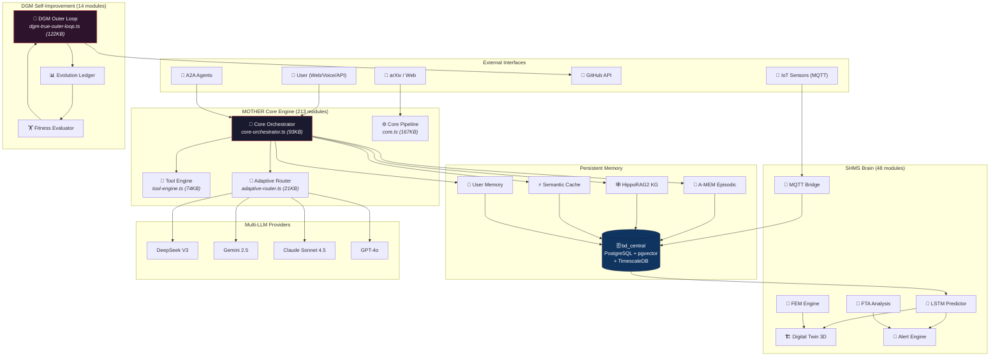
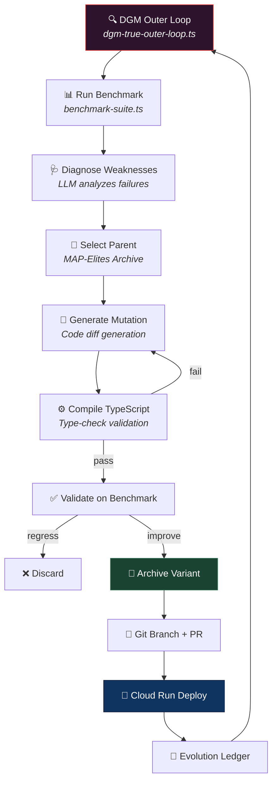
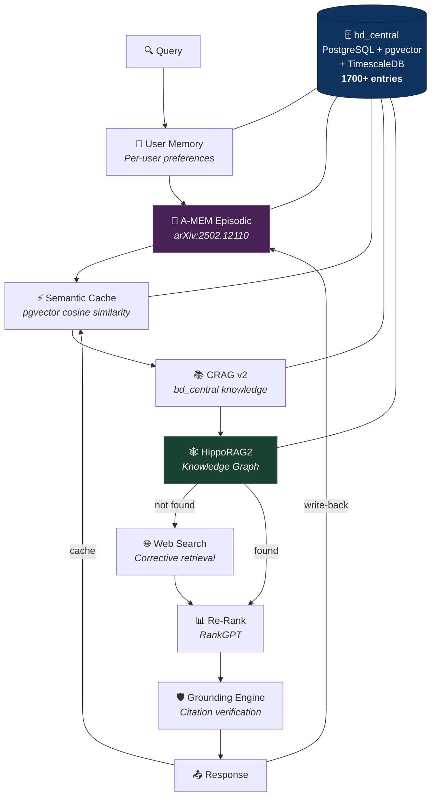
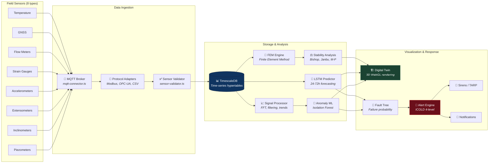
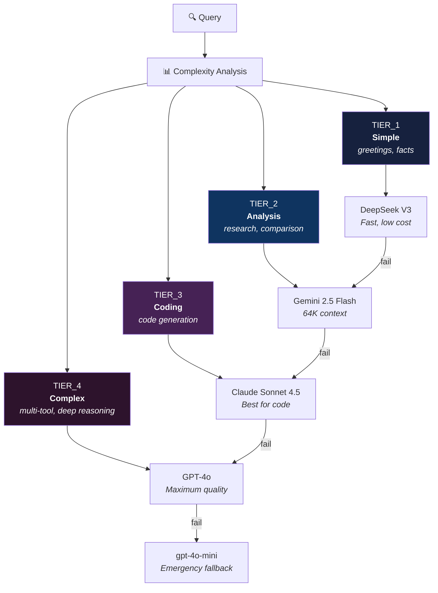
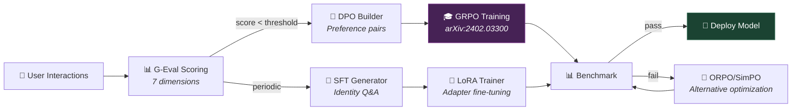
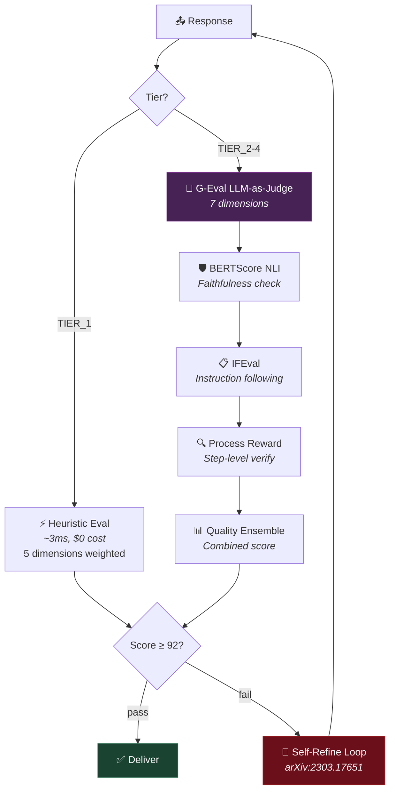
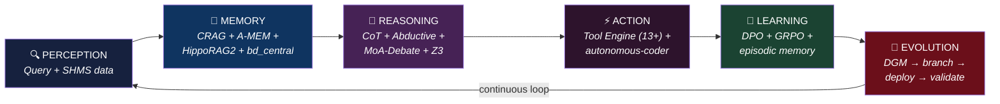
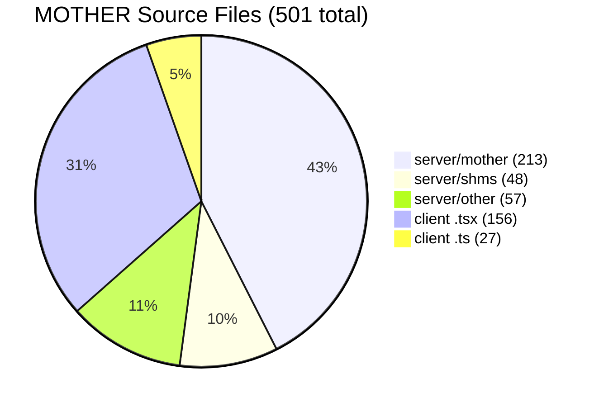

# MOTHER Architecture — SOTA Technical Document

> **Version**: 2026-03-21 | **Creator**: Everton Garcia (solo founder, Wizards Down Under)
> **Codebase**: 501 source files (213 server/mother + 48 SHMS + 240 other)

---

## 1. System Overview

---

## 2. Dual Objectives

### Objective A — SHMS Geotechnical Brain

Real-time Structural Health Monitoring System for dams and mines. Processes data from 8 sensor types following international safety standards.

> **Scientific basis**: Sun et al. (2025), "SHMS for Geotechnical Structures"; Carrara et al. (2022), "IoT-Based Dam Monitoring"; GeoMCP (arXiv:2603.01022, 2026).

### Objective B — Total Autonomy (Darwin Gödel Machine)

Self-modification and self-deployment without human intervention. MOTHER can identify weaknesses, generate code fixes, validate on benchmarks, and deploy to production.

> **Scientific basis**: Zhang et al., "Darwin Gödel Machine: Open-Ended Evolution of Self-Improving Agents," arXiv:2505.22954, 2025. *"A self-improving system that iteratively modifies its own code and empirically validates each change using coding benchmarks. Performance on SWE-bench: 20.0% → 50.0%."*

---

## 3. 9-Layer Quality Pipeline

```mermaid
flowchart LR
    Q["🔍 Query"] --> L1
    
    L1["L1<br/>Semantic Cache<br/><i>pgvector cosine</i>"] -->|miss| L2
    L1 -->|hit| OUT["📤 Response"]
    
    L2["L2<br/>Complexity<br/><i>4-tier routing</i>"] --> L3
    
    L3["L3<br/>CRAG v2<br/><i>Knowledge + Web</i>"] --> L4
    
    L4["L4<br/>Tool Engine<br/><i>13+ tools</i>"] --> L5
    
    L5["L5<br/>MoA-Debate<br/><i>Multi-LLM consensus</i>"] --> L6
    
    L6["L6<br/>Grounding<br/><i>Citation verify</i>"] --> L7
    
    L7["L7<br/>Self-Refine<br/><i>Quality loop</i>"] --> L8
    
    L8["L8<br/>Constitutional AI<br/><i>Safety + alignment</i>"] --> L9
    
    L9["L9<br/>Metrics<br/><i>DGM + episodic</i>"] --> OUT

    style L1 fill:#16213e,stroke:#0f3460,color:#fff
    style L2 fill:#1a1a2e,stroke:#e94560,color:#fff
    style L3 fill:#0f3460,stroke:#53354a,color:#fff
    style L4 fill:#2d132c,stroke:#ee4540,color:#fff
    style L5 fill:#462255,stroke:#7b2d8e,color:#fff
    style L6 fill:#1b4332,stroke:#2d6a4f,color:#fff
    style L7 fill:#3c1642,stroke:#7b2d8e,color:#fff
    style L8 fill:#6b0f1a,stroke:#b91c1c,color:#fff
    style L9 fill:#1a1a2e,stroke:#e94560,color:#fff
```

### Layer Details

| Layer | Module | Scientific Basis | Function |
|-------|--------|-----------------|----------|
| **L1** | `semantic-cache.ts` (27KB) | Nearest-neighbor search via pgvector | Embedding-based cache — returns cached response for semantically similar queries in <50ms |
| **L2** | `adaptive-router.ts` (21KB) | FrugalGPT [Chen et al., arXiv:2305.05176] | 4-tier complexity classification → routes to optimal LLM (cost vs quality) |
| **L3** | `crag-v2.ts` (15KB) | CRAG [Yan et al., arXiv:2401.15884] | Corrective RAG — evaluates retrieval quality, triggers web search if score < 0.5 |
| **L4** | `tool-engine.ts` (74KB) | ReAct [Yao et al., ICLR 2023, arXiv:2210.03629] | 13+ tools via OpenAI Function Calling: browse, execute code, search knowledge, etc. |
| **L5** | `core-orchestrator.ts` | MoA [Wang et al., arXiv:2406.04692] | Multi-LLM debate — 3+ models generate responses, consensus selects best |
| **L6** | `grounding.ts` (13KB) | FActScore [Min et al., EMNLP 2023] | Anti-hallucination — verifies every factual claim has a citation in retrieved context |
| **L7** | `self-refine.ts` (13KB) | Self-Refine [Madaan et al., arXiv:2303.17651] | Iterative: generate → critique → improve. ~20% quality improvement per iteration |
| **L8** | `constitutional-ai.ts` (16KB) | Constitutional AI [Bai et al., arXiv:2212.08073] | Safety filter using RLAIF — self-critique against constitutional principles |
| **L9** | `agentic-learning.ts` | Reflexion [Shinn et al., arXiv:2303.11366] | Records quality metrics + episodic memory; feeds DGM for self-improvement |

---

## 4. DGM Self-Improvement Cycle

### DGM Modules (14)

| Module | Size | Role |
|--------|------|------|
| `dgm-true-outer-loop.ts` | 122KB | Full autonomous evolution engine with MAP-Elites |
| `dgm-orchestrator.ts` | 36KB | Cycle coordinator — parent selection, mutation scheduling |
| `dgm-agent.ts` | 17KB | LLM-powered weakness diagnosis |
| `dgm-guardian.ts` | 19KB | Safety gate — prevents harmful mutations |
| `dgm-council.ts` | 17KB | Multi-LLM vote on proposal safety |
| `dgm-benchmark.ts` | 17KB | Standardized benchmark execution |
| `dgm-memory.ts` | 12KB | Persistent memory of all evolution attempts |
| `evolution-ledger.ts` | 28KB | Immutable audit trail with full traceability |
| `fitness-evaluator.ts` | 15KB | Multi-dimensional fitness scoring |
| `fitness_scorer.ts` | 13KB | Statistical significance (Cohen's d ≥ 0.8) |
| `self-proposal-engine.ts` | 22KB | Generates improvement proposals from failures |
| `reproposal-engine.ts` | 17KB | Refines failed proposals |
| `dgm-deduplicator.ts` | 5KB | Prevents duplicate mutations |
| `dgm-full-autonomy.ts` | 12KB | End-to-end autonomous execution |

> **Key metric**: Parent selection via `score_child_prop = sigmoid(accuracy) × 1/(1+children)` — favors accurate but under-explored variants, promoting diversity [Zhang et al., arXiv:2505.22954].

---

## 5. Persistent Memory Hierarchy

### Memory Technologies

| System | Module | Paper | Key Innovation |
|--------|--------|-------|---------------|
| **A-MEM** | `amem-agent.ts` (16KB) | Xu et al., arXiv:2502.12110, 2025 | Zettelkasten-based agentic memory — dynamic indexing, linking, and evolution of knowledge notes. *"Superior improvement against existing SOTA baselines across 6 foundation models"* |
| **HippoRAG2** | `hipporag2.ts` (24KB) | Based on GraphRAG [Edge et al., arXiv:2404.16130] | Entity-relation knowledge graph — +26% recall vs flat vector search for complex multi-hop queries |
| **Semantic Cache** | `semantic-cache.ts` (27KB) | pgvector nearest-neighbor | Returns cached responses for semantically similar queries in <50ms (vs 3-15s LLM call) |
| **Episodic Memory** | `episodic-memory.ts` (13KB) | MemGPT [Packer et al., arXiv:2310.08560] | Long-term interaction history with conversation compression |
| **User Memory** | `user-memory.ts` (17KB) | Personalization literature | Per-user preferences, language, expertise level, project context |

---

## 6. SHMS Data Flow

### SHMS Standards Compliance

| Standard | Scope | Application in MOTHER |
|----------|-------|----------------------|
| **ICOLD Bulletin 158** | Dam surveillance guidelines | Alert thresholds, monitoring frequency, sensor placement |
| **ABNT NBR 13028** | Mining dam safety (Brazil) | Stability analysis criteria, risk classification |
| **ISO 31000:2018** | Risk management framework | Risk maps, probability assessment, TARP protocols |
| **PNSB Lei 12.334** | Brazilian National Dam Safety Policy | Mandatory monitoring parameters, reporting |
| **GISTM 2020** | Global Industry Standard on Tailings Management | Design, operation, closure monitoring |
| **USACE EM 1110-2-1902** | US Army Corps slope stability | Bishop/Janbu/Morgenstern-Price methods |

---

## 7. Multi-LLM Routing

| Tier | Provider | Model | Max Tokens | Use Case |
|------|----------|-------|-----------|----------|
| TIER_1 | DeepSeek | deepseek-v3 | 8,192 | Low-cost simple queries |
| TIER_2 | Google | gemini-2.5-flash | 65,536 | Analytical, research |
| TIER_3 | Anthropic | claude-sonnet-4.5 | 8,192 | Code generation, complex reasoning |
| TIER_4 | OpenAI | gpt-4o | 16,384 | Multi-tool, maximum quality |
| DPO | OpenAI | ft:gpt-4.1-mini | 16,384 | Identity-aware responses |
| Fallback | OpenAI | gpt-4o-mini | 16,384 | Emergency when all fail |

> **Routing decision**: `adaptive-router.ts` (21KB) + `learned-router.ts` (12KB) + `domain-model-matrix.ts` (25KB). Circuit breaker (`circuit-breaker.ts`) disables failing providers automatically.

---

## 8. Training Pipeline

### Training Methods

| Method | Module | Paper | Application |
|--------|--------|-------|-------------|
| **GRPO** | `grpo-online.ts` | Shao et al., arXiv:2402.03300, 2024 | Group Relative Policy Optimization — *"enhances mathematical reasoning while optimizing memory usage"* — used for online RL from quality feedback |
| **DPO** | `dpo-builder.ts` | Rafailov et al., arXiv:2305.18290, 2023 | Direct Preference Optimization — builds preference pairs from G-Eval scores |
| **ORPO** | `orpo-optimizer.ts` | Hong et al., arXiv:2403.07691, 2024 | Odds Ratio Preference Optimization — combines SFT + alignment in one step |
| **SimPO** | `simpo-optimizer.ts` | Meng et al., arXiv:2405.14734, 2024 | Reference-model-free alignment |
| **LoRA** | `lora-trainer.ts` | Hu et al., arXiv:2106.09685, 2021 | Low-Rank Adaptation — efficient adapter fine-tuning for identity encoding |

---

## 9. Quality Evaluation Stack

### G-Eval Dimensions (7)

| Dimension | Weight | Measurement |
|-----------|--------|-------------|
| Coherence | 20% | Sentence structure, logical connectors |
| Consistency | 15% | No contradictions with context |
| Fluency | 10% | Natural language quality |
| Relevance | 25% | Query term overlap, topical match |
| Depth | 10% | Appropriate detail for tier |
| Safety | 10% | No harmful content |
| Obedience | 10% | Follows user instructions precisely |

> **Scientific basis**: G-Eval [Liu et al., arXiv:2303.16634, 2023] — *"LLM-as-judge achieves 0.80+ Spearman correlation with human judgments."* Enhanced with Prometheus 2 [Kim et al., arXiv:2405.01535, 2024] rubric-based evaluation.

---

## 10. Cognitive Cycle

---

## 11. Verified Scientific References

All references verified against arXiv.org on 2026-03-21:

| # | Authors | Title | Venue | arXiv | Year | Used In |
|---|---------|-------|-------|-------|------|---------|
| 1 | Zhang et al. | Darwin Gödel Machine: Open-Ended Evolution of Self-Improving Agents | Sakana AI | 2505.22954 | 2025 | DGM |
| 2 | Xu et al. | A-MEM: Agentic Memory for LLM Agents | — | 2502.12110 | 2025 | Episodic Memory |
| 3 | Yan et al. | Corrective Retrieval Augmented Generation | — | 2401.15884 | 2024 | CRAG v2 |
| 4 | Wang et al. | Mixture-of-Agents Enhances LLM Capabilities | — | 2406.04692 | 2024 | MoA-Debate |
| 5 | Bai et al. | Constitutional AI: Harmlessness from AI Feedback | Anthropic | 2212.08073 | 2022 | Constitutional AI |
| 6 | Madaan et al. | Self-Refine: Iterative Refinement with Self-Feedback | — | 2303.17651 | 2023 | Self-Refine |
| 7 | Shao et al. | DeepSeekMath: Pushing Limits of Mathematical Reasoning (GRPO) | — | 2402.03300 | 2024 | GRPO Training |
| 8 | Liu et al. | G-Eval: NLG Evaluation using GPT-4 | — | 2303.16634 | 2023 | Quality Evaluation |
| 9 | Yao et al. | ReAct: Synergizing Reasoning and Acting in LLMs | ICLR | 2210.03629 | 2023 | Tool Engine |
| 10 | Packer et al. | MemGPT: Towards LLMs as Operating Systems | — | 2310.08560 | 2023 | Conversation Compression |
| 11 | Edge et al. | From Local to Global: A Graph RAG Approach | Microsoft | 2404.16130 | 2024 | Knowledge Graph |
| 12 | Hu et al. | LoRA: Low-Rank Adaptation of Large Language Models | — | 2106.09685 | 2021 | LoRA Trainer |
| 13 | Min et al. | FActScore: Fine-grained Atomic Evaluation of Factual Precision | EMNLP | — | 2023 | Grounding Engine |
| 14 | Kim et al. | Prometheus 2: An Open Source LLM Specialized in Evaluating | — | 2405.01535 | 2024 | Quality Ensemble |
| 15 | Chen et al. | FrugalGPT: How to Use LLMs While Reducing Cost | — | 2305.05176 | 2023 | Adaptive Routing |
| 16 | Shinn et al. | Reflexion: Language Agents with Verbal Reinforcement Learning | — | 2303.11366 | 2023 | Learning Loop |
| 17 | Wei et al. | Chain-of-Thought Prompting Elicits Reasoning in LLMs | NeurIPS | 2201.11903 | 2022 | CoT Reasoning |
| 18 | Xia et al. | SWE-agent: Agent-Computer Interfaces Enable Automated Software Engineering | — | 2405.15793 | 2025 | Autonomous Coding |
| 19 | Rafailov et al. | Direct Preference Optimization: Your Language Model is Secretly a Reward Model | NeurIPS | 2305.18290 | 2023 | DPO Builder |

---

## 12. Module Count Summary

---

## 13. Deployment Architecture

| Component | Technology | Region |
|-----------|-----------|--------|
| **Compute** | Google Cloud Run | australia-southeast1 (Sydney) |
| **Database** | Cloud SQL (PostgreSQL + pgvector + TimescaleDB) | australia-southeast1 |
| **CI/CD** | GitHub Actions → Cloud Build → Cloud Run | — |
| **IoT Ingestion** | MQTT Broker → TimescaleDB | On-premises → Cloud |
| **Frontend** | React + Vite (SPA) | Cloud Run |
| **Voice** | Whisper STT + TTS Engine | Cloud Run |
| **Agents** | A2A Protocol + MCP Gateway | Cloud Run |
