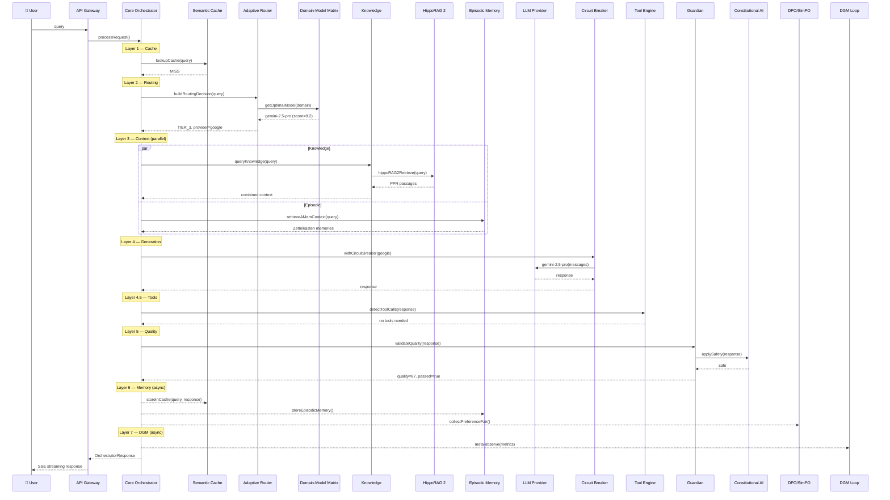

# Diagrama Completo de Interconexão — MOTHER System

> Baseado em **120+ dependências reais** extraídas dos imports de **206 módulos** via análise estática do código-fonte.

## Diagrama Principal — Como Todos os Módulos se Completam

```mermaid
graph TB
    %% ═══════════════════════════════════════════
    %% ENTRY POINTS (onde tudo começa)
    %% ═══════════════════════════════════════════
    
    USER(["👤 User Request"]) --> A2A["a2a-server.ts\n(API Gateway)"]
    USER --> PE["production-entry.ts\n(tRPC Router)"]

    %% ═══════════════════════════════════════════
    %% CORE PIPELINE (o coração do sistema)
    %% ═══════════════════════════════════════════

    A2A --> CORE["core.ts\n160K — Legacy Pipeline\n40+ imports"]
    PE --> CORE
    A2A --> CO["core-orchestrator.ts\n1949L — 8-Layer Pipeline"]
    CORE --> CO

    %% ═══════════════════════════════════════════
    %% CORE.TS → 40+ MODULE CONNECTIONS
    %% ═══════════════════════════════════════════

    CORE --> INT["intelligence.ts\n10 categories"]
    CORE --> ORC["orchestration.ts\nMoA / Debate"]
    CORE --> TE["tool-engine.ts\n20+ tools"]
    CORE --> GU["guardian.ts\nG-Eval 7D"]
    CORE --> KN["knowledge.ts\nbd_central"]
    CORE --> EMB["embeddings.ts\nVector Search"]
    CORE --> KG["knowledge-graph.ts\nGraphRAG"]
    CORE --> CRAGV2["crag-v2.ts\nCorrective RAG"]
    CORE --> GR["grounding.ts\nRARR"]
    CORE --> SR["self-refine.ts\nSelf-Refine"]
    CORE --> CAI["constitutional-ai.ts\nSafety"]
    CORE --> SF["selfcheck-faithfulness.ts"]
    CORE --> SFS["semantic-faithfulness-scorer.ts"]
    CORE --> PRM["process-reward-verifier.ts"]
    CORE --> SC_CON["self-consistency.ts"]
    CORE --> RR["rag-reranker.ts\nRankGPT"]
    CORE --> OBS["observability.ts\nMetrics"]
    CORE --> LN["learning.ts\nLearning Loop"]
    CORE --> UM["user-memory.ts\nUser Profiles"]
    CORE --> UP["update-proposals.ts\nDGM Proposals"]
    CORE --> SPE["self-proposal-engine.ts"]
    CORE --> OLE["output-length-estimator.ts\nOLAR"]
    CORE --> ABD["abductive-engine.ts\nHypothesis"]
    CORE --> AS["active-study.ts\nArXiv Ingestion"]
    CORE --> AL["agentic-learning.ts\nFact Validation"]
    CORE --> RES["research.ts\nSearch"]
    CORE --> CI["citation-engine.ts"]
    CORE --> LFE["long-form-engine-v3.ts"]
    CORE --> REACT_M["react.ts\nReAct"]
    CORE --> TOT["tot-router.ts\nTree of Thought"]
    CORE --> CCOT["contrastive-cot.ts"]
    CORE --> LCDE["long-cot-depth-enhancer.ts"]
    CORE --> TTC["test-time-compute-scaler.ts"]
    CORE --> PSC["parallel-self-consistency.ts"]
    CORE --> SO["structured-output.ts"]
    CORE --> DGA["dgm-agent.ts"]
    CORE --> GA["guardian-agent.ts"]
    CORE --> AUTO["autonomy.ts"]
    CORE --> MAG["metrics-aggregation-job.ts"]
    CORE --> MM["metacognitive-monitor.ts"]
    CORE --> PR["proactive-retrieval.ts"]
    CORE --> QES["quality-ensemble-scorer.ts"]
    CORE --> SMV["symbolic-math-verifier.ts"]
    CORE --> Z3["z3-subprocess-verifier.ts"]
    CORE --> FOL["fol-detector.ts"]
    CORE --> BSNLI["bertscore-nli-faithfulness.ts"]
    CORE --> FDP["fdpo-faithfulness-calibrator.ts"]
    CORE --> IFV["ifv.ts\nInstruction Verifier"]
    CORE --> NSVIF["nsvif-instruction-verifier.ts"]
    CORE --> IFV2["ifeval-verifier-v2.ts"]
    CORE --> CC["cognitive-calibrator.ts"]
    CORE --> CCV["creative-constraint-validator.ts"]
    CORE --> DPA["depth-prm-activator.ts"]
    CORE --> COVE["cove.ts\nChain of Verification"]
    CORE --> LFE2["lock-free-explainer.ts"]
    CORE --> GRPO["grpo-reasoning-enhancer.ts"]
    CORE --> AKI["auto-knowledge-injector.ts"]
    CORE --> FICH["fichamento.ts"]
    CORE --> UH["user-hierarchy.ts"]
    CORE --> DBR["db-retry.ts"]

    %% ═══════════════════════════════════════════
    %% CORE-ORCHESTRATOR.TS → 16 CONNECTIONS
    %% ═══════════════════════════════════════════

    CO --> AR["adaptive-router.ts\n4-Tier Router"]
    CO --> SC["semantic-cache.ts\nCosine Sim"]
    CO --> CB["circuit-breaker.ts\nMulti-Provider"]
    CO --> GU
    CO --> TE
    CO --> OBS
    CO --> AS
    CO --> DGEC["dynamic-geval-calibrator.ts"]
    CO --> OLE
    CO --> CI
    CO --> PRM
    CO --> RP["response-planner.ts"]
    CO --> RN["response-normalizer.ts"]
    CO --> COMP["conversation-compressor.ts\nMemGPT"]
    CO --> CSCO["context-scorer.ts\nSelf-RAG"]
    CO --> MR["memory-recall.ts\nProactive"]
    CO --> DC["depth-controller.ts"]
    CO --> IVR["inline-verifier.ts"]

    %% ═══════════════════════════════════════════
    %% ROUTING SUBSYSTEM
    %% ═══════════════════════════════════════════

    AR --> DMM["domain-model-matrix.ts\n9 Benchmarks"]
    AR --> DR["domain-rules.ts\n12 Domains"]
    SC_CON --> INT
    CCOT --> INT

    %% ═══════════════════════════════════════════
    %% KNOWLEDGE / RAG SUBSYSTEM
    %% ═══════════════════════════════════════════

    KN --> EMB
    KN --> HR["hipporag2.ts\nPPR + Persistence"]
    KN --> AKC["autonomous-knowledge-curator.ts"]
    CRAGV2 --> RL["reliability-logger.ts"]
    PR --> KN
    MR --> EMB
    QES --> DGEC
    DGEC --> KN

    %% ═══════════════════════════════════════════
    %% TOOL ENGINE → 15 CONNECTIONS
    %% ═══════════════════════════════════════════

    TE --> CORE
    TE --> KN
    TE --> KG
    TE --> ABD
    TE --> DPO["dpo-builder.ts\nDPO Alignment"]
    TE --> SIMPO["simpo-optimizer.ts\nSimPO"]
    TE --> ORPO["orpo-optimizer.ts\nORPO"]
    TE --> RLVR["rlvr-verifier.ts\nHLE Benchmark"]
    TE --> SI["self-improve.ts\nMAPE-K"]
    TE --> SCR["self-code-reader.ts"]
    TE --> SCW["self-code-writer.ts"]
    TE --> BA["browser-agent.ts\nWeb Access"]
    TE --> MA["media-agent.ts\nDALL-E"]
    TE --> SBX["code-sandbox.ts\nE2B"]
    TE --> AD["admin-docs.ts"]
    TE --> UP

    %% ═══════════════════════════════════════════
    %% QUALITY / SAFETY SUBSYSTEM
    %% ═══════════════════════════════════════════

    GU --> CAI
    GU --> GP["guardian-patches.ts"]
    GU --> RL
    SR --> RL
    SF --> RL
    PRM --> RL
    GA --> CB
    GA --> SC

    %% ═══════════════════════════════════════════
    %% MEMORY & LEARNING SUBSYSTEM
    %% ═══════════════════════════════════════════

    LN --> EMB
    LN --> MEM["memory_agent.ts\nA-MEM"]
    UM --> EMB
    AL --> KN
    AL --> PI["paper-ingest.ts"]
    AL --> RES
    AS --> PI
    AS --> KN
    AS --> FICH
    BA --> KN
    SR_REP["self-repair.ts"] --> AL
    SR_REP --> KN
    SR_REP --> GR
    SR_REP --> PI
    SR_REP --> RES

    %% ═══════════════════════════════════════════
    %% DGM / SELF-IMPROVEMENT SUBSYSTEM
    %% ═══════════════════════════════════════════

    DGM_OL["dgm-true-outer-loop.ts\n118K — Main Loop"] --> CORE
    DGM_OL --> CO
    DGM_OL --> FE["fitness-evaluator.ts"]
    DGM_OL --> SM["self-modifier.ts"]
    DGM_OL --> AT["audit-trail.ts"]
    DGM_OL --> SG["safety-gate.ts"]
    DGM_OL --> GWS["github-write-service.ts"]
    DGM_OL --> E2B["e2b-sandbox.ts"]

    DO["dgm-orchestrator.ts\n36K"] --> FE
    DO --> SM
    DO --> SG
    DO --> AT
    DO --> DV["deploy-validator.ts"]
    DO --> DB["dgm-benchmark.ts"]
    DO --> DD["dgm-deduplicator.ts"]
    DO --> FP["finetuning-pipeline.ts"]
    DO --> LT["lora-trainer.ts"]

    SI --> ABD
    SI --> DPO
    SI --> KG
    SI --> RLVR
    SPE --> UP
    EL["evolution-ledger.ts"] --> ZIV["zero-intervention-validator.ts"]
    DGA --> GA

    %% ═══════════════════════════════════════════
    %% A2A SERVER → AUTONOMOUS AGENTS
    %% ═══════════════════════════════════════════

    A2A --> APC["autonomous-knowledge-curator.ts"]
    A2A --> APR["autonomous-pr-agent.ts"]
    A2A --> APM["autonomous-project-manager.ts"]
    A2A --> ABR["autonomy-benchmark-runner.ts"]
    A2A --> SAA["self-architect-agent.ts"]
    A2A --> SRA["self-repair-agent.ts"]
    A2A --> CKI["council-knowledge-injector.ts"]
    A2A --> PH["provider-health.ts"]
    A2A --> DO
    A2A --> FE
    A2A --> ZIV
    A2A --> KN
    A2A --> CB

    APM --> AT
    APM --> SG
    CKI --> KN

    %% ═══════════════════════════════════════════
    %% SHMS DOMAIN
    %% ═══════════════════════════════════════════

    SHMS["shms-geval-geotechnical.ts\n72K"] -.-> GU
    SDT["shms-digital-twin-v2.ts"] --> SHMS_AE["shms-alert-engine-v2.ts"]
    SDT --> SNEKF["shms-neural-ekf.ts"]
    SHMS_AE --> SHMS_AS["shms-alerts-service.ts"]
    SHMS_AE --> SNEKF
    SHMS_APP["shms-application.ts"] --> APPR["application-registry.ts"]

    %% ═══════════════════════════════════════════
    %% LONG-FORM + MEDIA
    %% ═══════════════════════════════════════════

    LFE --> CORE
    LFE --> GW["google-workspace-bridge.ts"]
    LFE --> TTS["tts-engine.ts"]

    %% ═══════════════════════════════════════════
    %% SUPERVISOR / AUTONOMY
    %% ═══════════════════════════════════════════

    SA_ACT["supervisor-activator.ts"] --> CCE["code-cycle-executor.ts"]
    SA_ACT --> SBX
    SA_ACT --> EM["episodic-memory.ts"]
    SA_ACT --> POA["proof-of-autonomy.ts"]
    SA_ACT --> SG
    SA_ACT --> SCW
    SA_ACT --> SUP["supervisor.ts"]
    
    RE["roadmap-executor.ts"] --> EM
    RE --> POA
    RE --> SA_ACT
    TD["task-decomposer.ts"] --> EM
    BR["benchmark-runner.ts"] --> EM
    BR --> POA

    %% ═══════════════════════════════════════════
    %% FINE-TUNING PIPELINE
    %% ═══════════════════════════════════════════
    
    CORE -.-> ORPO_FP["orpo-finetune-pipeline.ts"]
    CORE -.-> RLVR_DPO["rlvr-dpo-connector.ts"]

    %% ═══════════════════════════════════════════
    %% INFRASTRUCTURE
    %% ═══════════════════════════════════════════

    CORE --> DB_MOD[("💾 MySQL\nmother_v7_prod")]
    KN --> DB_MOD
    EMB --> DB_MOD
    HR --> DB_MOD
    SC --> DB_MOD
    LN --> DB_MOD
    UP --> DB_MOD

    CO -.->|"API calls"| OPENAI(["🟢 OpenAI"])
    CO -.->|"API calls"| ANTHRO(["🔵 Anthropic"])
    CO -.->|"API calls"| GOOGLE(["🟡 Google"])
    CO -.->|"API calls"| DEEPSEEK(["🟣 DeepSeek"])

    BA -.->|"scraping"| WEB(["🌐 Web / arXiv"])

    %% ═══════════════════════════════════════════
    %% STYLES
    %% ═══════════════════════════════════════════

    classDef core fill:#E91E63,color:#fff,stroke:#C2185B,stroke-width:3px
    classDef routing fill:#FF9800,color:#fff,stroke:#F57C00,stroke-width:2px
    classDef knowledge fill:#4CAF50,color:#fff,stroke:#388E3C,stroke-width:2px
    classDef quality fill:#F44336,color:#fff,stroke:#D32F2F,stroke-width:2px
    classDef tools fill:#FF5722,color:#fff,stroke:#E64A19,stroke-width:2px
    classDef dgm fill:#673AB7,color:#fff,stroke:#512DA8,stroke-width:2px
    classDef memory fill:#00BCD4,color:#fff,stroke:#0097A7,stroke-width:2px
    classDef shms fill:#795548,color:#fff,stroke:#5D4037,stroke-width:2px
    classDef infra fill:#607D8B,color:#fff,stroke:#455A64,stroke-width:2px
    classDef provider fill:#9E9E9E,color:#fff,stroke:#757575,stroke-width:1px
    classDef entry fill:#2196F3,color:#fff,stroke:#1976D2,stroke-width:3px

    class CORE,CO core
    class AR,INT,DMM,DR,OLE,SC_CON,CCOT routing
    class KN,EMB,HR,KG,CRAGV2,GR,RR,CSCO,CI,SC,PR,MR,AKC knowledge
    class GU,CAI,SR,SF,SFS,PRM,GA,GP,RL,CB,GP,IVR quality
    class TE,BA,MA,SBX,SCR,SCW,AD,SBX tools
    class DGM_OL,DO,SM,SI,SPE,EL,FE,DGA,DPO,SIMPO,ORPO,FP,LT,RLVR,GRPO,UP,ZIV dgm
    class LN,UM,EM,AL,AS,PI,MEM,FICH,RES,COMP memory
    class SHMS,SDT,SNEKF,SHMS_AE,SHMS_AS,SHMS_APP shms
    class DB_MOD,OBS,MAG,DBR infra
    class OPENAI,ANTHRO,GOOGLE,DEEPSEEK,WEB provider
    class USER,A2A,PE entry
```

## Legenda de Cores

| Cor | Subsistema | Qtd Módulos |
|-----|-----------|:-----------:|
| 🔴 **Rosa** | Core Pipeline | 2 |
| 🟠 **Laranja** | Routing & Classification | 6 |
| 🟢 **Verde** | Knowledge & RAG | 14 |
| 🔴 **Vermelho** | Quality & Safety | 12 |
| 🟤 **Red-Orange** | Tool Engine & Agents | 7 |
| 🟣 **Roxo** | DGM & Self-Improvement | 17 |
| 🔵 **Cyan** | Memory & Learning | 10 |
| 🟤 **Marrom** | SHMS Domain | 6 |
| ⬛ **Cinza** | Infrastructure | 4 |
| 🔵 **Azul** | Entry Points | 3 |

## Estatísticas de Interconexão

| Módulo Hub | Imports Diretos | Papel |
|-----------|:--------------:|-------|
| `core.ts` | **50+** | Legacy pipeline — importa quase tudo |
| `core-orchestrator.ts` | **18** | New 8-layer pipeline — importa routing, cache, quality |
| `tool-engine.ts` | **15** | Tool execution — importa knowledge, code, DPO |
| `a2a-server.ts` | **19** | API gateway — importa autonomous agents |
| `dgm-true-outer-loop.ts` | **7** | Self-improvement — importa core, sandbox, git |
| `dgm-orchestrator.ts` | **9** | DGM orchestration — importa benchmarks, safety |
| `knowledge.ts` | **3** | Knowledge aggregator — importado por 10+ módulos |
| `guardian.ts` | **3** | Quality gate — importado por 5+ módulos |
| `embeddings.ts` | **0** | Leaf module — importado por 8+ módulos |
| `reliability-logger.ts` | **0** | Leaf module — importado por 7+ módulos |

## Fluxo Completo: User → Response

## Ciclos de Feedback (Como Módulos se Auto-Alimentam)

```mermaid
flowchart LR
    subgraph "📊 Ciclo de Qualidade"
        Q1["Queries"] --> Q2["Guardian\nG-Eval Score"]
        Q2 --> Q3["DPO Pair\nCollector"]
        Q3 --> Q4["Fine-tune\nModel"]
        Q4 --> Q5["Better\nResponses"]
        Q5 --> Q1
    end
    
    subgraph "🧠 Ciclo de Aprendizado"
        L1["User\nQueries"] --> L2["Pattern\nExtractor"]
        L2 --> L3["Wisdom\nDistillation"]
        L3 --> L4["Knowledge\nCurator"]
        L4 --> L5["bd_central\nUpdated"]
        L5 --> L6["Better\nContext"]
        L6 --> L1
    end

    subgraph "🧬 Ciclo DGM"
        D1["Metrics\nCollection"] --> D2["Gap\nAnalysis"]
        D2 --> D3["Proposal\nGeneration"]
        D3 --> D4["Code\nModification"]
        D4 --> D5["Test &\nDeploy"]
        D5 --> D6["Evolution\nLedger"]
        D6 --> D1
    end

    subgraph "💭 Ciclo de Memória"
        M1["Conversation"] --> M2["Episodic\nStorage"]
        M2 --> M3["A-MEM\nZettelkasten"]
        M3 --> M4["Profile\nConsolidation"]
        M4 --> M5["Temporal\nDecay"]
        M5 --> M6["Better\nPersonalization"]
        M6 --> M1
    end

    style Q2 fill:#F44336,color:#fff
    style L3 fill:#4CAF50,color:#fff
    style D4 fill:#673AB7,color:#fff
    style M3 fill:#00BCD4,color:#fff
```

