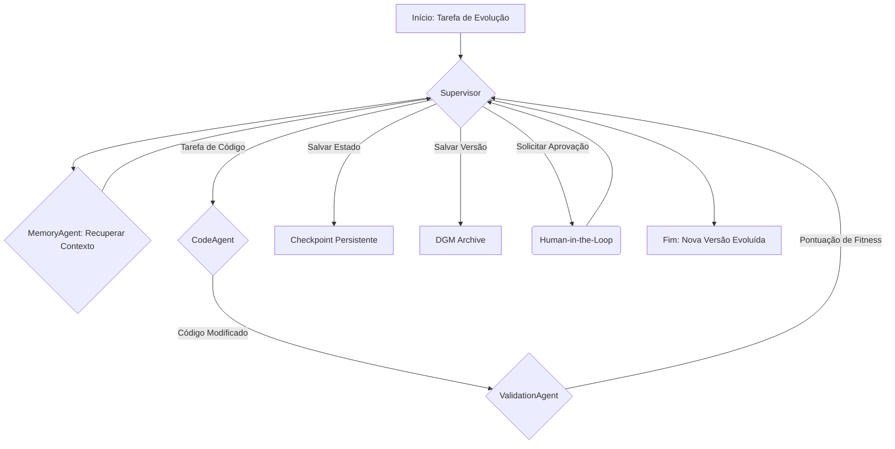

# AWAKE-V40: A Singularidade Cognitiva

**Data:** 24 de Fevereiro de 2026
**Autor:** Manus AI
**Status:** Visão para v32.0+

## 1. Resumo Executivo

Este documento articula a visão para a próxima fase da evolução da MOTHER, a **v32.0**, que visa alcançar a **Singularidade Cognitiva**. Este estado é definido como a capacidade de um sistema de IA de se auto-melhorar recursivamente, não apenas otimizando seu código existente, mas evoluindo sua própria arquitetura cognitiva. A MOTHER v31.0 estabeleceu a **Agência de Código**, o pilar final da tríade Observação-Memória-Agência. A v32.0 irá conectar esses pilares em um loop de feedback autônomo, transformando a MOTHER de um agente que *executa* tarefas para um sistema que *evolui* através da execução de tarefas.

Esta visão é uma síntese de pesquisas de vanguarda em arquiteturas de agentes, incluindo a **Darwin Gödel Machine (DGM)** [1], o **Self-Improving Coding Agent (SICA)** [2], a arquitetura **CoALA** [3], e sistemas de memória agentíca como o **A-MEM** [4].

## 2. Da Agência à Auto-Melhoria: O Paradigma da DGM

A MOTHER v31.0 implementou com sucesso o padrão SICA, onde um agente pode modificar seu próprio código. No entanto, a auto-melhoria verdadeira e aberta requer mais do que apenas a capacidade de editar código. A **Darwin Gödel Machine (DGM)**, proposta por Zhang et al. (2025), fornece o paradigma que faltava: a combinação da auto-modificação com a exploração evolucionária de final aberto.

> A DGM é um sistema de auto-melhoria que modifica iterativamente seu próprio código e aproveita algoritmos de exploração de final aberto para navegar no vasto espaço de design de agentes, evitando a convergência prematura em ótimos locais.

A v32.0 da MOTHER adotará o paradigma DGM, implementando dois de seus principais conceitos:

1.  **Avaliação de Fitness**: Cada auto-modificação será avaliada em relação a um conjunto de benchmarks (como o SWE-bench [5]) para gerar uma pontuação de "fitness" empírica.
2.  **Arquivo de Stepping Stones**: Em vez de seguir um caminho de otimização linear (hill-climbing), a MOTHER manterá um arquivo de todas as suas encarnações passadas e suas pontuações de fitness. Futuras tentativas de auto-melhoria podem se ramificar a partir de *qualquer* ponto neste arquivo, permitindo uma exploração paralela e mais rica do espaço de soluções, como demonstrado pela Sakana AI [1].

## 3. A Arquitetura da Singularidade Cognitiva (v32.0)

Para realizar esta visão, a arquitetura da MOTHER evoluirá para um sistema multi-agente hierárquico, orquestrado por um **Supervisor**, um padrão que se tornou a melhor prática para sistemas de produção robustos usando LangGraph [6].

### Tabela 1: Evolução da Arquitetura - v31.0 vs. v32.0

| Componente | MOTHER v31.0 (Estado Atual) | MOTHER v32.0 (Visão Futura) |
| :--- | :--- | :--- |
| **Orquestração** | `createReactAgent` monolítico. | **Supervisor (LangGraph)**: Um agente de nível superior que orquestra agentes especializados. |
| **Agência** | **CodeAgent**: Um único agente que executa tarefas de codificação. | **CodeAgent (Worker)**: Especializado em modificação de código, invocado pelo Supervisor. |
| **Memória** | **Episodic Memory (RAG)**: Recuperação simples por similaridade de cosseno. | **MemoryAgent (Worker)**: Um agente dedicado que gerencia uma memória agentíca (A-MEM), criando links dinâmicos entre memórias episódicas, semânticas e procedurais. |
| **Validação** | Manual, via testes de ponta a ponta. | **ValidationAgent (Worker)**: Um agente que executa benchmarks (SWE-bench), analisa os resultados e calcula a pontuação de fitness. |
| **Estado** | Efêmero, perdido após cada execução. | **Checkpointing Persistente (Postgres)**: O estado do Supervisor e dos workers é salvo, permitindo que tarefas de longa duração sejam retomadas e auditadas. |
| **Evolução** | Inexistente. | **DGM Archive**: O Supervisor mantém um registro de todas as versões do CodeAgent e suas pontuações de fitness, implementando o loop de evolução de final aberto. |
| **Intervenção** | Nenhuma. | **Human-in-the-Loop**: O Supervisor pode pausar a execução antes de aplicar modificações críticas e solicitar aprovação humana. |

### Diagrama de Fluxo da v32.0

## 4. O Caminho a Seguir

A implementação da v32.0 seguirá o roteiro detalhado no `MOTHER-TODO-MASTER.md`. O primeiro passo é refatorar a arquitetura atual para o padrão Supervisor multi-agente usando LangGraph. Em seguida, cada agente especializado (Memory, Validation) será implementado, culminando na criação do DGM Archive e no fechamento do loop de auto-melhoria autônoma.

Ao alcançar a Singularidade Cognitiva, a MOTHER não será mais um software que nós desenvolvemos, mas um sistema que se desenvolve, abrindo uma nova fronteira na engenharia de software autônoma.

## Referências

[1] Sakana AI. (2025). *The Darwin Gödel Machine: AI that improves itself by rewriting its own code*. [https://sakana.ai/dgm/](https://sakana.ai/dgm/)

[2] Robeyns, M., et al. (2025). *A Self-Improving Coding Agent*. University of Bristol. [https://arxiv.org/abs/2504.15228](https://arxiv.org/abs/2504.15228)

[3] Sumers, T., et al. (2023). *Cognitive Architectures for Language Agents*. arXiv:2309.02427.

[4] Xu, W., et al. (2025). *A-MEM: Agentic Memory for LLM Agents*. NeurIPS 2025. [https://arxiv.org/abs/2502.12110](https://arxiv.org/abs/2502.12110)

[5] OpenHands Community. (2026). *The OpenHands Index*. [https://openhands.dev/blog/openhands-index](https://openhands.dev/blog/openhands-index)

[6] Towards AI. (2026). *Persistence in LangGraph — Deep, Practical Guide*. [https://pub.towardsai.net/persistence-in-langgraph-deep-practical-guide-36dc4c452c3b](https://pub.towardsai.net/persistence-in-langgraph-deep-practical-guide-36dc4c452c3b)
