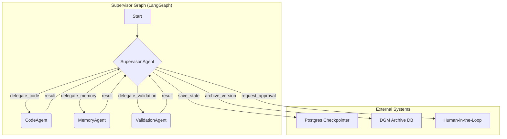

# MOTHER v32.0 - The Cognitive Singularity

**Version:** 32.0 (Implementation Roadmap)
**Status:** 📋 Ready for Implementation

## 1. Overview

Version 32.0 marks the most significant architectural evolution in MOTHER's history, transitioning from a single, monolithic agent to a **multi-agent system** designed for **recursive self-improvement**. This version implements the **Cognitive Singularity** vision outlined in `AWAKE-V40.md`, transforming MOTHER into a **Darwin Gödel Machine (DGM)**.

The core of v32.0 is a **Supervisor-Worker** pattern, orchestrated using LangGraph. A high-level `Supervisor` agent plans and delegates tasks to a team of specialized `Worker` agents, each responsible for a specific cognitive function: coding, memory, and validation. This architecture provides the foundation for autonomous, open-ended evolution.

## 2. Architecture: The Multi-Agent Darwin Gödel Machine

The v32.0 architecture is composed of a central Supervisor and three specialized worker agents. The entire workflow is managed as a stateful graph with persistent checkpointing, allowing for complex, long-running evolutionary tasks that are both auditable and resumable.

### Key Components

| Component | Role | Technology/Pattern |
| :--- | :--- | :--- |
| **Supervisor Agent** | **Orchestrator**. Decomposes goals, delegates tasks to workers, and manages the evolutionary loop. | LangGraph `StatefulGraph` |
| **CodeAgent** | **The Coder**. Executes specific software engineering tasks by modifying the codebase. | Tool-using LLM Agent (v31.0 pattern) |
| **MemoryAgent** | **The Archivist**. Manages long-term memory, providing context and insights to other agents. | Retrieval-Augmented Generation (RAG) with A-MEM principles |
| **ValidationAgent** | **The Critic**. Evaluates the fitness of new code versions by running benchmarks. | SWE-bench integration, shell execution |
| **Postgres Checkpointer** | **Persistent State**. Saves the state of the graph, enabling resumable and auditable workflows. | `langgraph.checkpoint.postgres.PostgresSaver` |
| **DGM Archive** | **Evolutionary Record**. A database table that stores the lineage and fitness of every evolved agent version. | PostgreSQL Table |
| **Human-in-the-Loop** | **Governance**. A mechanism for the Supervisor to pause and request human approval for critical actions. | LangGraph `interrupt_before` |

## 3. The Evolutionary Loop (DGM Process)

The primary function of the v32.0 system is to execute the DGM loop:

1.  **Goal Definition**: The process starts with a high-level goal (e.g., "Improve performance on SWE-bench by 5%").
2.  **Delegation**: The `Supervisor` delegates to the `MemoryAgent` to gather context, then to the `CodeAgent` to attempt a self-modification.
3.  **Validation**: The `ValidationAgent` benchmarks the new code and reports a fitness score.
4.  **Archiving**: The `Supervisor` records the new version, its parent, and its fitness score in the DGM Archive.
5.  **Continuation**: The `Supervisor` selects the next agent to branch from (not necessarily the best one) and continues the loop, enabling open-ended exploration.

## 4. API Changes

The existing `mother.runCodeAgent` endpoint will be **deprecated**. It will be replaced by a new, more powerful endpoint:

-   **Endpoint:** `supervisor.evolve`
-   **Type:** `mutation`
-   **Input:** `{ goal: string, parent_version_id?: string }`
-   **Function:** Initiates a long-running DGM evolutionary loop. The request returns a `run_id` that can be used to monitor the status of the asynchronous process.

## 5. Implementation Roadmap

The detailed implementation plan is tracked in the `MOTHER-TODO-MASTER.md` file. The high-level phases are:

1.  **Refactor to Multi-Agent**: Convert the v31.0 agent into the Supervisor-Worker architecture.
2.  **Implement Persistence**: Integrate Postgres for state checkpointing and the DGM Archive.
3.  **Build Worker Agents**: Develop the specialized `MemoryAgent` and `ValidationAgent`.
4.  **Close the Loop**: Implement the full DGM evolutionary process within the `Supervisor`.

This version represents the culmination of the project's vision: a truly autonomous, self-improving cognitive system. 
