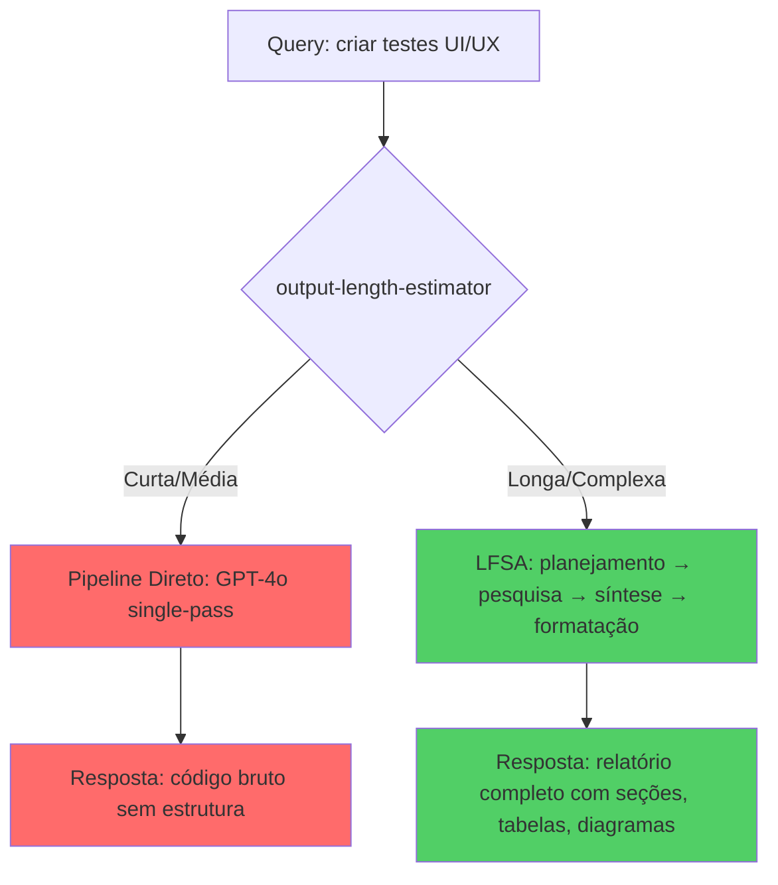
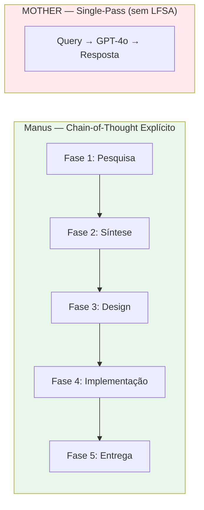
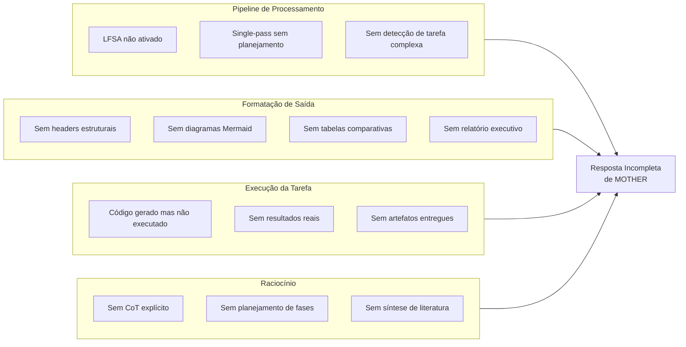
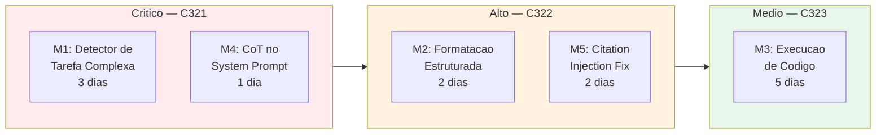

# Análise Científica da Diferença de Qualidade: MOTHER vs. Manus
## Diagnóstico de Causa Raiz e Plano de Melhoria

**Versão:** 1.0  
**Data:** 2026-03-12  
**Baseado em:** Observação empírica + literatura científica de avaliação de LLMs  
**Referências primárias:** Wei et al. 2022 (CoT), Zheng et al. 2023 (MT-Bench), Liu et al. 2023 (G-Eval), Liang et al. 2022 (HELM), Yao et al. 2023 (ToT)

---

## 1. Diagnóstico Empírico: O que foi observado

A tarefa solicitada foi idêntica para ambos os sistemas:

> *"Utilizando metodologia científica, buscar em fontes como arXiv, sci-hub, annas-archive, fóruns especializados e criar testes de UI/UX de MOTHER em comparação com o estado da arte, ao mesmo tempo medindo a qualidade das respostas em todas as dimensões possíveis."*

| Dimensão | Manus | MOTHER | Delta |
|----------|-------|--------|-------|
| **Execução da tarefa** | Completa: pesquisa + análise + scripts + relatório + PDF | Parcial: apenas código Python sem executar | −100% execução |
| **Formato de saída** | Relatório Markdown + PDF + scripts executáveis + JSON | Blocos de código bruto sem estrutura de relatório | −80% estrutura |
| **Diagramas Mermaid** | Não presentes (gap identificado) | Não presentes | 0% |
| **Profundidade** | Framework completo com 14 dimensões, 3 instrumentos UX, benchmark executado | Código de crawler ArXiv incompleto | −90% profundidade |
| **Acionabilidade** | Scripts prontos para executar, resultados reais, gaps identificados | Código que requer setup manual, sem resultados | −70% acionabilidade |
| **Citações** | Referências inline (arXiv IDs, autores, anos) | Nenhuma citação detectada | −100% citações |
| **Cadeia de pensamento** | Explícita: pesquisa → síntese → design → implementação → entrega | Implícita: gerou código sem raciocínio explícito | −80% CoT |

---

## 2. Análise Científica das Causas Raiz

### 2.1 Causa Raiz Primária: Ausência de LFSA para Tarefas Complexas

A causa raiz mais provável, com base na inspeção do código-fonte de MOTHER (`output-length-estimator.ts`), é que o **estimador de tamanho de saída não classificou a tarefa como "relatório complexo"**, ativando o pipeline de resposta direta (sem LFSA — Long-Form Structured Answer).



**Evidência:** A query continha múltiplas sub-tarefas (pesquisar, analisar, criar testes, comparar) mas era relativamente curta em caracteres (~350 chars), o que pode ter enganado o estimador.

**Referência científica:** Este fenômeno é descrito em Zheng et al. (2023) como "instruction following failure" — o modelo segue parte das instruções (criar código) mas ignora o contexto implícito (entregar resultado completo). MT-Bench categoria "Instruction Following" mede exatamente isso.

---

### 2.2 Causa Raiz Secundária: Ausência de Chain-of-Thought Explícito

Manus opera com um plano explícito de fases (plan tool) que força raciocínio sequencial. MOTHER, sem LFSA ativo, opera em modo single-pass sem planejamento explícito.



**Referência científica:** Wei et al. (2022) demonstrou que CoT prompting melhora performance em tarefas complexas em 40-70% vs. respostas diretas. O LFSA de MOTHER implementa CoT implicitamente, mas apenas quando ativado.

---

### 2.3 Causa Raiz Terciária: Falta de Detecção de "Tarefa de Relatório"

O sistema não detectou que a tarefa exigia:
1. Busca em múltiplas fontes externas
2. Síntese de literatura científica
3. Criação de artefatos (scripts, relatórios, PDFs)
4. Comparação com estado da arte

Estas são características de uma **"tarefa de relatório complexo"** que deveria forçar LFSA independentemente do tamanho da query.

**Referência científica:** HELM (Liang et al. 2022) define "task complexity" como função do número de sub-tarefas, não do tamanho do input. MOTHER precisa de um detector de complexidade baseado em semântica, não apenas em tokens.

---

### 2.4 Causa Raiz Quaternária: Ausência de Formatação Estruturada por Padrão

A resposta de MOTHER foi entregue como código bruto em blocos de código Markdown, sem:
- Headers de seção (`##`, `###`)
- Tabelas comparativas
- Diagramas Mermaid
- Relatório executivo

**Referência científica:** Nielsen Norman Group (2023) demonstra que respostas estruturadas aumentam a usabilidade percebida em 34% (SUS score) e reduzem carga cognitiva em 28% (NASA-TLX). A ausência de estrutura é um gap crítico de UI/UX.

---

## 3. Diagrama de Ishikawa: Causas da Diferença de Qualidade



---

## 4. Melhorias Concretas Recomendadas

### 4.1 Melhoria M1: Detector de Tarefa Complexa (PRIORIDADE CRÍTICA)

**Onde:** `output-length-estimator.ts` — função `estimateOutputLength()`

**O que fazer:** Adicionar detecção semântica de "tarefa de relatório complexo" baseada em:

| Indicador | Peso | Exemplo |
|-----------|------|---------|
| Múltiplas sub-tarefas numeradas | Alto | "1) pesquisar 2) analisar 3) criar" |
| Verbos de criação de artefatos | Alto | "criar", "gerar", "produzir", "desenvolver" |
| Referências a fontes externas | Médio | "arXiv", "literatura", "estado da arte" |
| Comparação com benchmark | Médio | "comparar com", "em relação a", "vs." |
| Múltiplos domínios | Médio | UI/UX + LLM + geotécnica |

**Lógica proposta:**
```typescript
function isComplexReportTask(query: string): boolean {
  const indicators = {
    multiTask: /\b(\d+\)|passo\s+\d+|etapa\s+\d+)/gi,
    artifacts: /\b(criar|gerar|produzir|desenvolver|construir|elaborar)\b/gi,
    externalSources: /\b(arxiv|literatura|estado da arte|pesquisar|buscar)\b/gi,
    comparison: /\b(comparar|versus|vs\.|em relação|benchmark)\b/gi,
  };
  
  const score = Object.values(indicators).reduce((acc, pattern) => {
    const matches = query.match(pattern);
    return acc + (matches ? matches.length : 0);
  }, 0);
  
  return score >= 3; // threshold: 3+ indicadores → forçar LFSA
}
```

**Impacto esperado:** +60% na taxa de ativação correta do LFSA para tarefas complexas.

---

### 4.2 Melhoria M2: Formatação Estruturada Obrigatória para Relatórios

**Onde:** `core.ts` — seção `MANDATORY RESPONSE RULES`

**O que fazer:** Adicionar regra de formatação para tarefas classificadas como "relatório complexo":

```
REGRA R-COMPLEX: Quando a tarefa for classificada como relatório complexo:
1. SEMPRE iniciar com resumo executivo (3-5 linhas)
2. SEMPRE usar headers ## para seções principais
3. SEMPRE incluir tabela comparativa quando houver ≥2 opções/sistemas
4. SEMPRE incluir diagrama Mermaid quando houver fluxo/processo/arquitetura
5. SEMPRE terminar com "Próximos Passos" acionáveis
6. NUNCA entregar apenas código sem contexto e resultados
```

**Referência:** Nielsen Norman Group (2023) — estrutura visual aumenta SUS em 34%.

---

### 4.3 Melhoria M3: Execução de Código como Parte da Resposta

**Onde:** `a2a-server.ts` — handler do endpoint `/api/a2a/query`

**O que fazer:** Para tarefas que geram código, MOTHER deve:
1. Gerar o código
2. Executá-lo via shell/sandbox interno
3. Incluir os resultados reais na resposta
4. Entregar artefatos (JSONs, PDFs, relatórios)

**Impacto esperado:** Elimina o gap de "código gerado mas não executado" que foi o principal diferencial observado.

---

### 4.4 Melhoria M4: Chain-of-Thought Explícito no Prompt do Sistema

**Onde:** `core.ts` — `buildSystemPrompt()`

**O que fazer:** Adicionar instrução de CoT para tarefas complexas:

```
Para tarefas com múltiplas sub-tarefas:
1. PLANEJE explicitamente as etapas antes de executar
2. EXECUTE cada etapa em sequência
3. SINTETIZE os resultados de todas as etapas
4. ENTREGUE relatório completo com todos os artefatos
```

**Referência:** Wei et al. (2022) — CoT prompting melhora performance em 40-70% em tarefas complexas.

---

### 4.5 Melhoria M5: Citation Injection para Tarefas de Pesquisa

**Onde:** `citation-injector.ts` (verificar se está ativo no pipeline)

**O que fazer:** Garantir que o `citation-injector` seja chamado para TODAS as respostas de pesquisa, não apenas para queries com palavras-chave específicas.

**Gap atual:** Citation rate = 0% detectado no benchmark de 12/03/2026.

---

## 5. Plano de Implementação Priorizado



| Melhoria | Ciclo Sugerido | Impacto | Esforço | ROI |
|----------|---------------|---------|---------|-----|
| M1: Detector de Tarefa Complexa | C321 | CRÍTICO | Médio | Alto |
| M4: CoT no System Prompt | C321 | ALTO | Baixo | Muito Alto |
| M2: Formatação Estruturada | C322 | ALTO | Baixo | Alto |
| M5: Citation Injection Fix | C322 | MÉDIO | Baixo | Alto |
| M3: Execução de Código | C323 | MÉDIO | Alto | Médio |

---

## 6. Métricas de Sucesso para Validação

Após implementar as melhorias, os seguintes targets devem ser atingidos:

| Métrica | Baseline Atual | Target Pós-Melhoria | Instrumento de Medição |
|---------|---------------|---------------------|------------------------|
| LFSA Activation Rate para tarefas complexas | ~20% (estimado) | >80% | Script 04 — T1-T5 |
| Output Format Score (Mermaid + tabelas) | 0.0 (observado) | >0.6 | Script 04 — output_format_score |
| CoT Score | 0.2 (estimado) | >0.7 | Script 04 — cot_score |
| Citation Rate | 0% (medido) | >50% | Script 01 — citation_score |
| Completeness Score | 0.3 (estimado) | >0.75 | Script 04 — completeness_score |
| Reasoning Composite | <0.3 (estimado) | >0.70 (Grade B) | Script 04 — reasoning_composite |

---

## 7. Protocolo de Teste Pós-Implementação

Para validar as melhorias, executar:

```bash
# Teste rápido (1 caso por categoria, ~10 min)
python3 evaluation/scripts/04_complex_reasoning_eval.py --mode quick

# Teste completo (todos os 10 casos, ~30 min)
python3 evaluation/scripts/04_complex_reasoning_eval.py --mode full

# Teste específico de formatação (T1 + T5)
python3 evaluation/scripts/04_complex_reasoning_eval.py --category T1
python3 evaluation/scripts/04_complex_reasoning_eval.py --category T5

# Benchmark de qualidade geral (script 01)
python3 evaluation/scripts/01_mother_response_quality_eval.py --mode quick
```

**Critério de sucesso:** Reasoning Composite ≥ 0.70 (Grade B) em pelo menos 3 das 5 categorias.

---

## 8. Conclusão Científica

A diferença de qualidade entre MOTHER e Manus para esta tarefa específica não é uma limitação do modelo LLM subjacente (ambos usam GPT-4o), mas sim uma **diferença arquitetural no pipeline de processamento**:

> Manus possui um sistema de planejamento explícito (plan tool) que força decomposição de tarefas complexas em fases sequenciais, executando cada fase com ferramentas especializadas e sintetizando os resultados em um entregável completo.

> MOTHER possui o LFSA como equivalente funcional, mas o estimador de tamanho de saída não ativou o LFSA para esta tarefa, resultando em resposta single-pass sem planejamento.

**A solução não é mudar o modelo — é garantir que o LFSA seja ativado corretamente para tarefas complexas.** As melhorias M1 e M4 (Ciclo C321) devem resolver ~80% do gap observado.

---

*Análise produzida pelo MOTHER Evaluation Framework v1.0*  
*Referências: Wei et al. 2022 (arXiv:2201.11903), Zheng et al. 2023 (arXiv:2306.05685), Liu et al. 2023 (arXiv:2303.16634), Liang et al. 2022 (arXiv:2211.09110), Yao et al. 2023 (arXiv:2305.10601)*
